# Diagram Templates - Mermaid

Templates và examples cho các loại Mermaid diagrams thường dùng trong tài liệu AWS.

## 1. Architecture Diagrams

### Basic Service Architecture

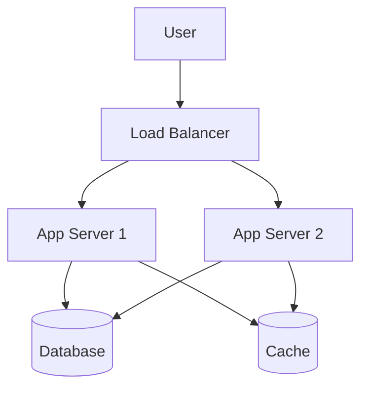

### Serverless Architecture

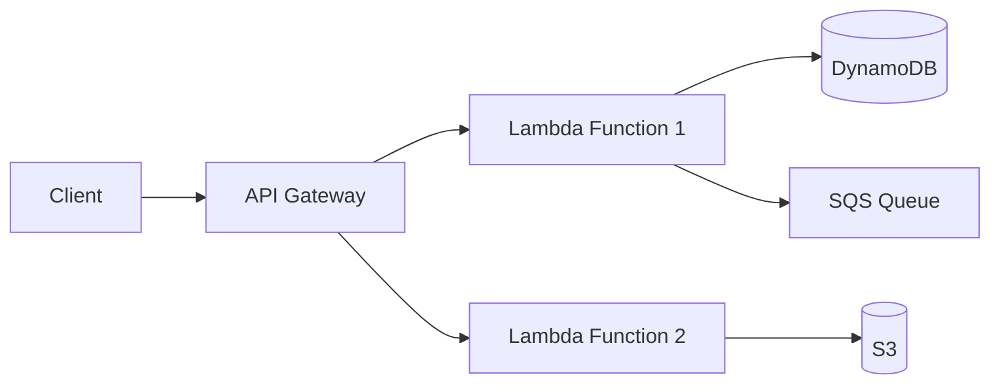

### Multi-Tier Architecture

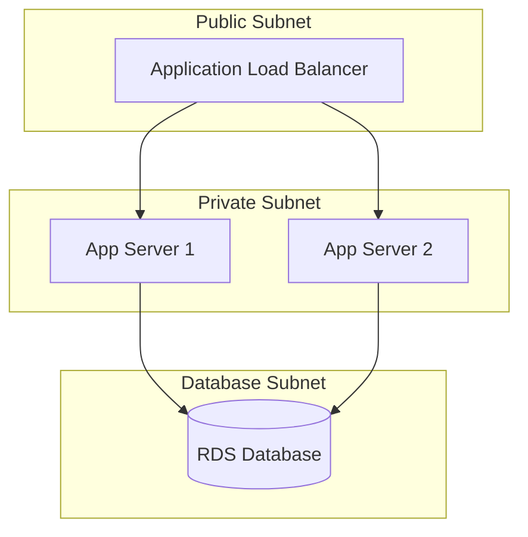

## 2. Flowcharts

### Request Flow

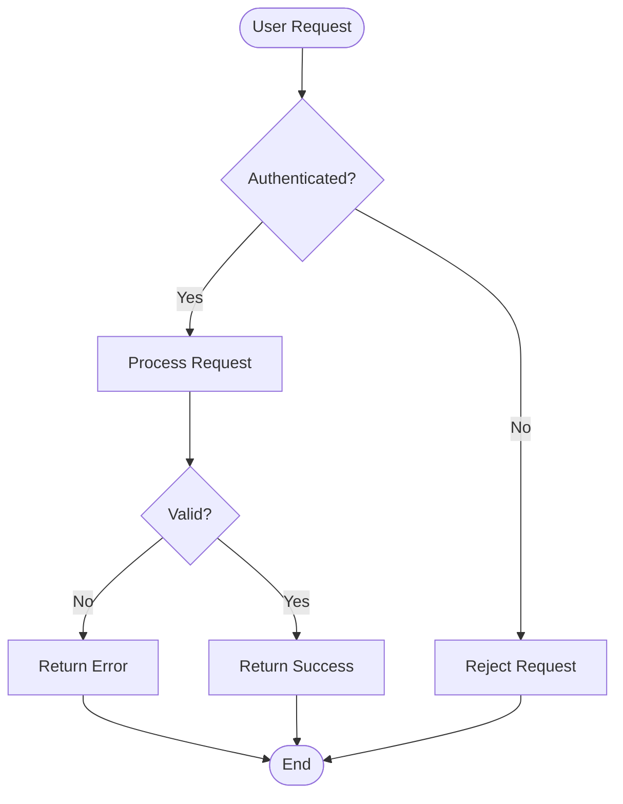

### Decision Flow

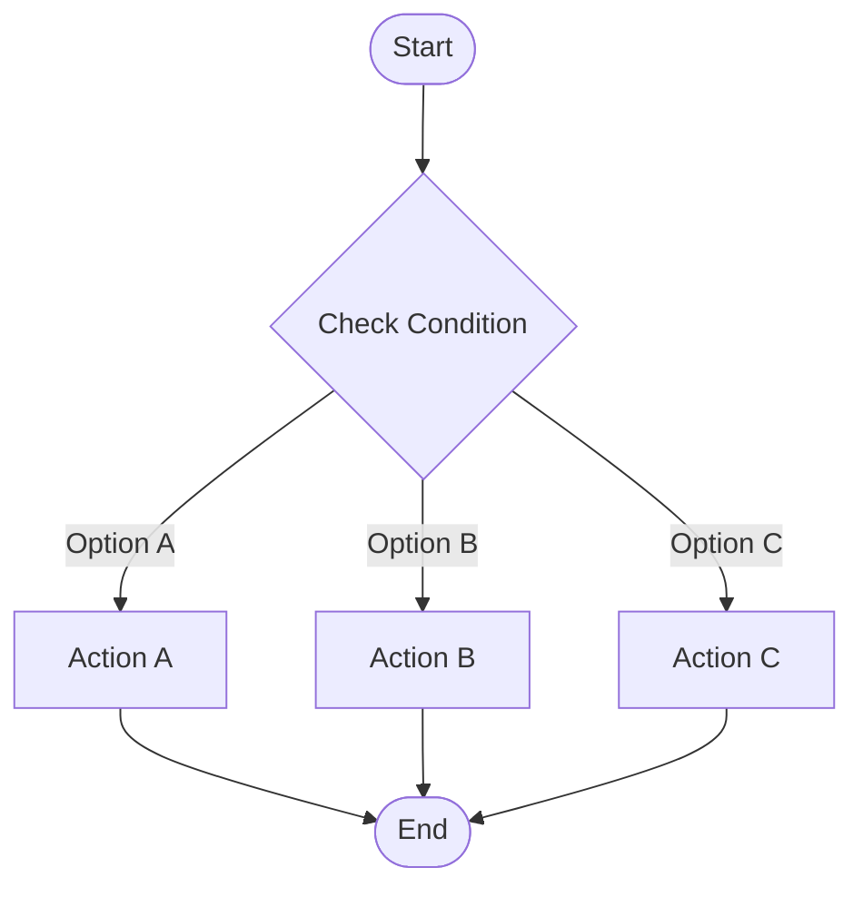

### EC2 Instance Lifecycle

```mermaid
stateDiagram-v2
    [*] --> Pending
    Pending --> Running
    Running --> Stopping
    Stopping --> Stopped
    Stopped --> Running
    Running --> Shutting-down
    Shutting-down --> Terminated
    Terminated --> [*]
```

## 3. Sequence Diagrams

### API Request Flow

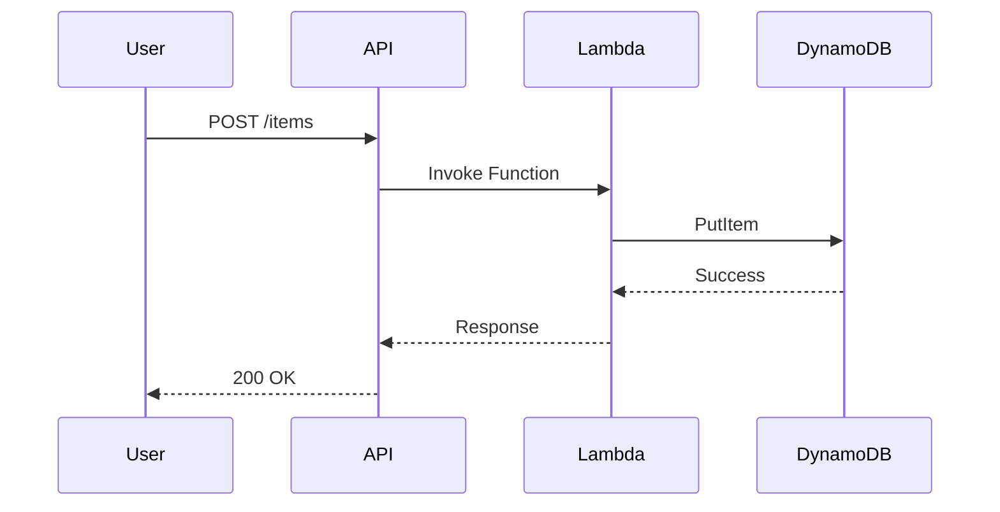

### Event-Driven Flow

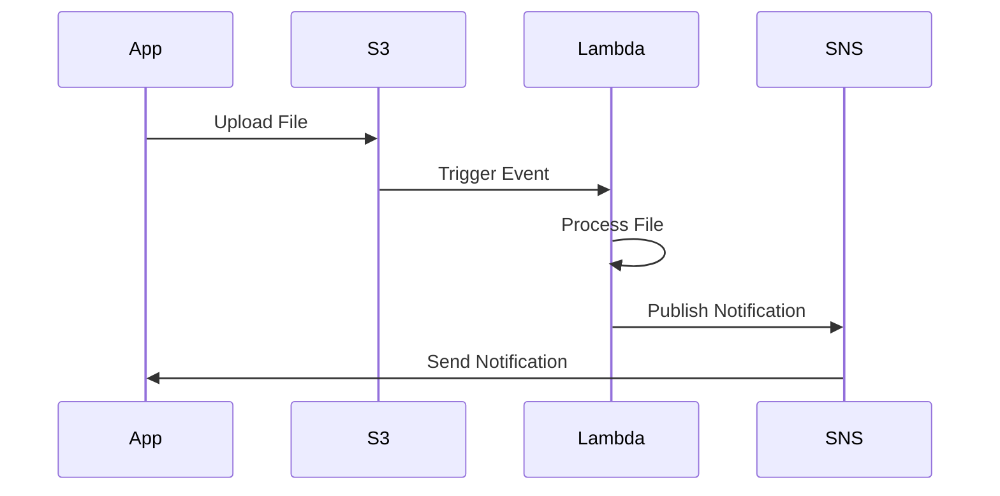

## 4. Mindmaps

### EC2 Overview

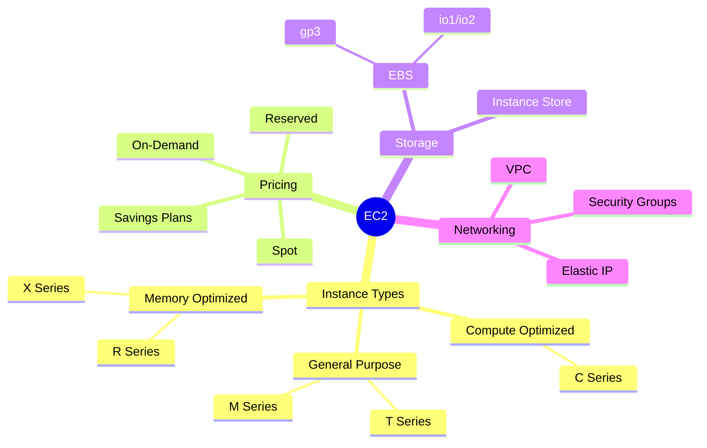

### AWS Services Overview

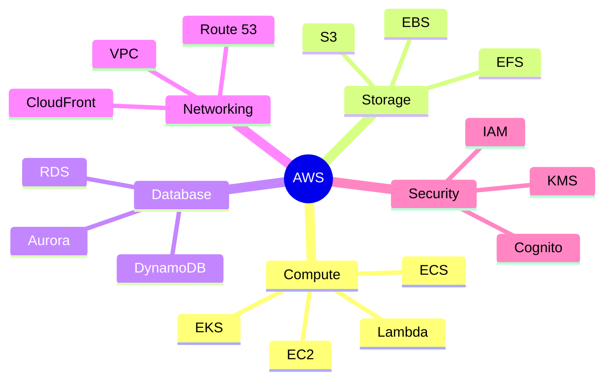

## 5. Class/Entity Diagrams

### IAM Structure

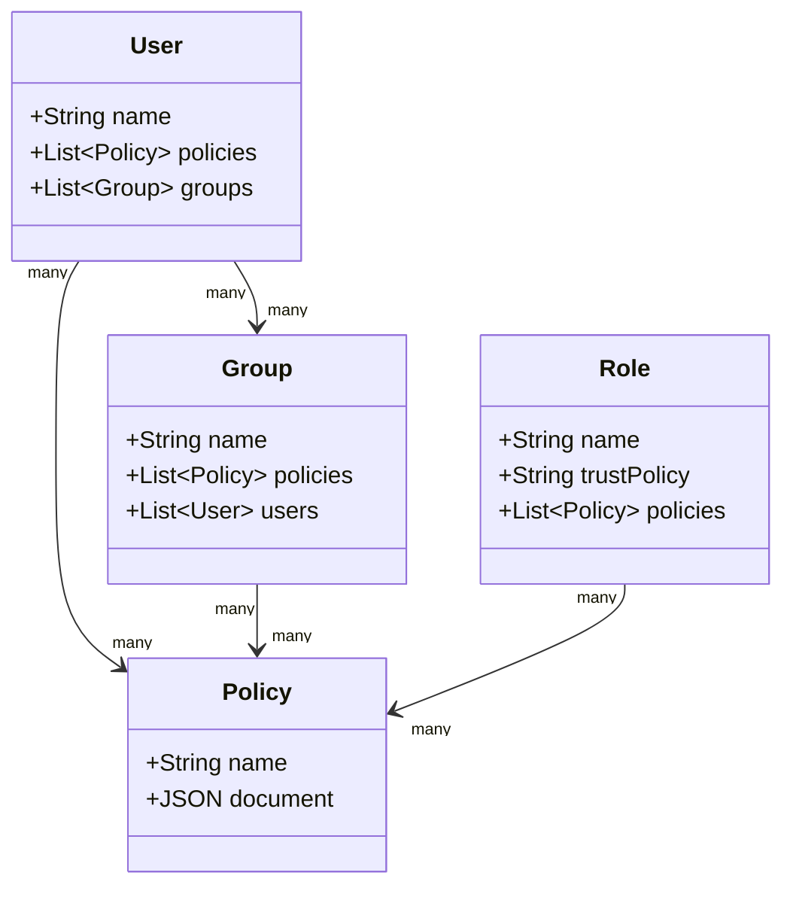

## 6. Gantt Charts

### Project Timeline

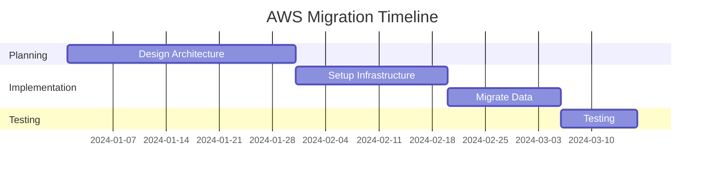

## 7. Pie Charts

### Cost Distribution

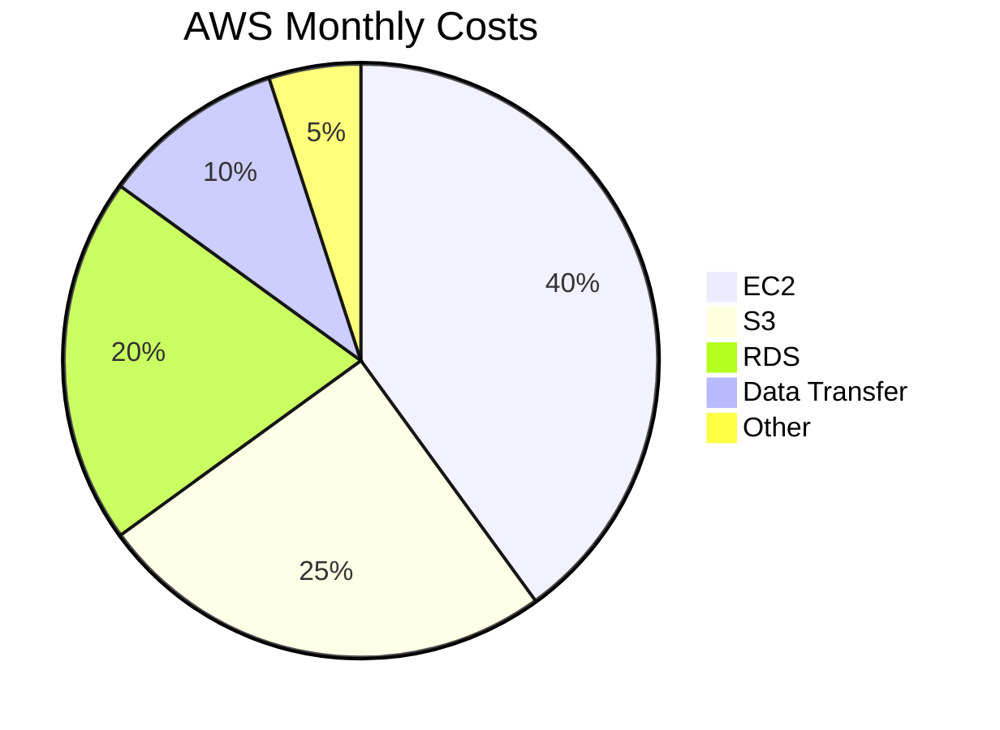

## 8. Git Graph

### Deployment Flow

```mermaid
gitgraph
    commit id: "Initial"
    branch develop
    checkout develop
    commit id: "Feature 1"
    commit id: "Feature 2"
    checkout main
    merge develop
    commit id: "Deploy"
```

## Best Practices

### 1. Simplicity

- Giữ diagrams đơn giản, dễ hiểu
- Tránh quá nhiều nodes/connections
- Tập trung vào concepts chính

### 2. Labels

- Sử dụng labels tiếng Việt cho mô tả
- Giữ service names tiếng Anh (EC2, S3, Lambda, v.v.)
- Thêm title và mô tả ngắn cho mỗi diagram

### 3. Colors & Styling

- Mermaid tự động apply theme (dark/light) dựa trên VitePress theme
- Có thể customize colors nếu cần:

  ```mermaid
  graph TB
      A[Node A]:::highlight
      B[Node B]
      classDef highlight fill:#f9f,stroke:#333,stroke-width:2px
  ```

### 4. Testing

- Luôn test render diagram trước khi commit
- Kiểm tra trên cả dark và light theme
- Đảm bảo diagram không quá lớn (có thể scroll)

## Examples trong Repo

Xem các file sau để tham khảo cách sử dụng diagrams:

- `docs/services/compute/ec2/` - EC2 concepts với diagrams
- `docs/architecture/` - Architecture patterns
- `docs/real-world/` - Real-world scenarios

## Resources

- [Mermaid Documentation](https://mermaid.js.org/)
- [Mermaid Live Editor](https://mermaid.live/) - Test diagrams online
- [Mermaid Syntax Guide](https://mermaid.js.org/intro/syntax-reference.html)
