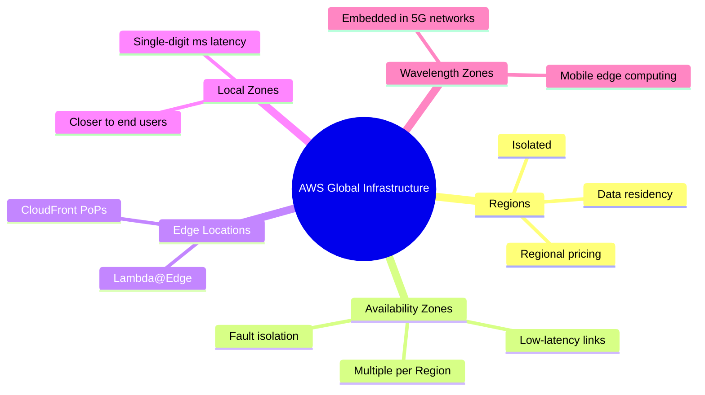

# AWS Global Infrastructure

## Summary

- AWS’ global infrastructure is built from **Regions, Availability Zones, Edge Locations, Local Zones, and Wavelength Zones** to deliver low‑latency, highly available, and fault‑tolerant applications.
- Choosing the right Region and designing across multiple AZs directly impacts **reliability, performance, compliance, and cost**.
- For most architectures, **Multi‑AZ within a Region** plus **CloudFront at the edge** is the baseline pattern for high availability and good user experience.

## Infrastructure overview (mindmap)

## Best Practices

- **Pick Regions deliberately** based on latency to users, compliance/data residency, required services, and pricing—not just by habit.
- Design **Multi‑AZ deployments** for production workloads (EC2, RDS, ECS, ALB, etc.) to survive an AZ failure without downtime.
- Use **CloudFront and Edge Locations** to move static content and caching closer to users and reduce latency and origin load.
- For ultra low‑latency workloads (gaming, media, 5G, AR/VR), evaluate **Local Zones** or **Wavelength Zones** where available.
- Plan for **disaster recovery**: Multi‑AZ for high availability inside a Region, and Multi‑Region for stricter RTO/RPO or regulatory needs.

## Exam Notes

- Be able to clearly distinguish **Region vs Availability Zone vs Edge Location**, and know typical design guidance (Multi‑AZ, Region selection, CloudFront for global).
- Many exam questions encode constraints like _data residency_, _latency to users_, or _global users_—which often point to a specific Region strategy or CloudFront.
- Remember that AWS publishes SLAs (for example, **EC2 Multi‑AZ 99.99%**, **S3 11 9’s durability**), but in exams you rarely need exact numbers—just which design improves availability.

## AWS documentation

- [AWS Global Infrastructure](https://aws.amazon.com/about-aws/global-infrastructure/)
- [Regions and Availability Zones](https://docs.aws.amazon.com/AWSEC2/latest/UserGuide/using-regions-availability-zones.html)

## Related docs in this Hub

- [What is AWS](./what-is-aws.md)
- [How to Study AWS](./how-to-study.md)
