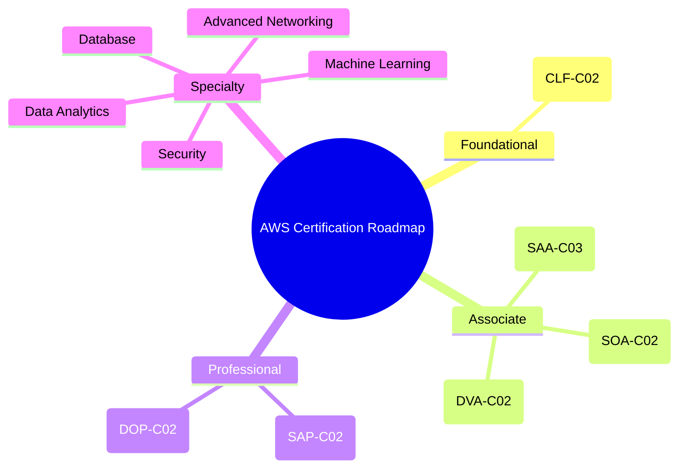

# Certification Roadmap

## Summary

- The AWS certification portfolio is organized by **level (Foundational, Associate, Professional)** and **Specialty** domains.
- A practical route is often: **Cloud Practitioner → 1–2 Associate certifications → Professional or a relevant Specialty**, depending on your role.
- The goal of a roadmap is to **avoid random exam chasing** and pick the path that best supports your day‑to‑day work.

## Certification mindmap

## Best Practices

- **Tie certifications to your role**:
  - Developers → `Developer Associate`, `Solutions Architect Associate`.
  - Ops/SRE/Infra → `SysOps`, `DevOps Professional`.
  - Architects → `Solutions Architect Associate` → `Solutions Architect Professional`.
- You don’t need **every** certification; pick 1–2 main tracks and go deep rather than spreading thin.
- Use `Cloud Practitioner` as an **on‑ramp** if you’re new to cloud or want a business‑level understanding before technical exams.
- After an Associate exam, aim for **6–12 months of real experience** before attempting Professional level to avoid purely theoretical knowledge.
- Only pursue a Specialty exam if you **regularly work** in that domain (Security, Data, ML, Networking, Database), as they are quite deep.

## Exam Notes

- Professional and Specialty exams are very **scenario‑heavy**; they expect broad service knowledge and comfort with multi‑service architectures.
- `Cloud Practitioner` focuses more on **concepts, pricing, support, and high‑level service roles** than on configuration details.
- Always read the **Exam Guide and Sample Questions** from AWS Training before committing to a new certification path.

## AWS documentation & resources

- [AWS Certification Paths](https://aws.amazon.com/certification/)
- [Exam Guides & Sample Questions](https://aws.amazon.com/certification/certification-prep/)
