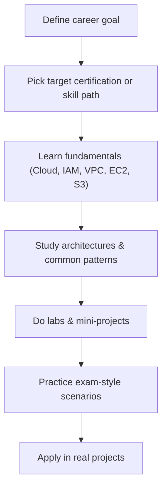

# How to Study AWS

## Summary

- Effective AWS learning combines **structured theory from official docs** with **regular, focused hands‑on practice** on the console/CLI and in labs.
- You’ll make faster progress by anchoring your study around **real use cases** (web apps, data analytics, automation) instead of memorizing every service.
- Exam preparation should align with your **target role and certification path**, not the other way around.

## Recommended learning flow

## Best Practices

- **Prioritize fundamentals**: Cloud concepts, IAM, VPC, EC2, S3, and at least one managed database (RDS/DynamoDB) form your core.
- Study in **short feedback loops**: read 20–30 minutes, then spend 20–30 minutes doing something concrete in AWS (create resources, break/fix, observe).
- Keep **official AWS resources** as your source of truth (docs, whitepapers, Well‑Architected, Skill Builder, re:Post).
- Build **small but realistic labs**: 3‑tier web app, static website on S3 + CloudFront, batch job on Lambda, simple data pipeline, etc.
- Practice **scenario questions** (especially for certifications): focus on requirements, constraints, and selecting the best‑fit service or architecture.
- Timebox your sessions and set clear outcomes (for example, “understand and demo private/public subnets and a NAT Gateway” in one sitting).

## Exam Notes

- AWS exams emphasize **architectural decisions and trade‑offs**, not just syntax or CLI flags.
- For each domain in the exam guide, ensure you can answer: _“Which service/architecture would I pick for X requirement, and why?”_
- Reviewing **wrong answers** and understanding why they’re wrong is as valuable as doing more questions.

## AWS documentation & resources

- [AWS Skill Builder](https://explore.skillbuilder.aws/)
- [AWS Training and Certification](https://www.aws.training/)
- [AWS Ramp-Up Guides](https://aws.amazon.com/training/ramp-up-guides/)
