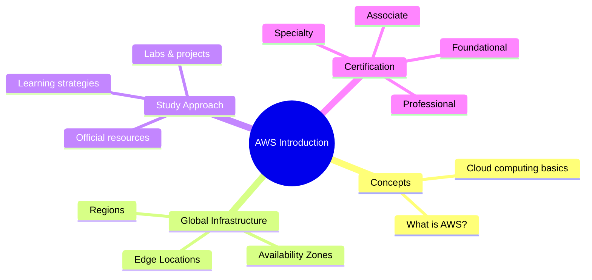

# Introduction

## Summary

- This section is your **entry point** into the AWS Knowledge Hub: what AWS is, how its global infrastructure is organized, and how to design your learning path.
- You’ll get a **high‑level view** of the platform (concepts, service categories, global footprint) before diving into fundamentals and individual services.
- Use this module to align your **career goals and certification plans** so the rest of your study is focused and efficient.

## Overview diagram

## Best Practices

- **Start with the “why”**: understand what problems AWS solves for businesses before memorizing service names.
- **Define your target role and certification** early (developer, architect, ops, data…) and let that drive what you go deep on first.
- Combine **reading with hands‑on labs**—every core concept you learn (IAM, EC2, S3, VPC) should be followed by a small experiment.
- Prefer **official AWS resources** (docs, whitepapers, Well‑Architected, Skill Builder) as your primary references; treat blogs and videos as supplements.
- Take structured notes (mindmaps, tables, comparison lists) focusing on **trade‑offs, use cases, and best practices** rather than copying docs verbatim.

## Next steps in this hub

- [What is AWS](./what-is-aws.md)
- [AWS Global Infrastructure](./aws-global-infrastructure.md)
- [How to Study AWS](./how-to-study.md)
- [Certification Roadmap](./certification-roadmap.md)
