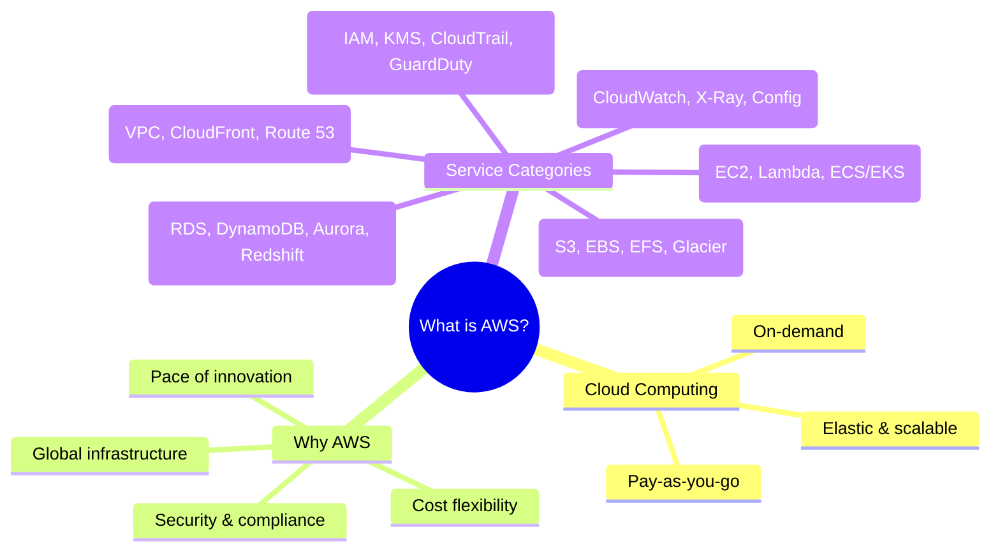

# What is AWS

## Summary

- **Amazon Web Services (AWS)** is a comprehensive cloud platform offering 200+ fully managed services so you can build applications without owning physical data centers.
- Cloud computing with AWS follows an **on‑demand, pay‑as‑you‑go** model with virtually unlimited scale, global reach, and strong security/compliance foundations.
- At the intro level, you mainly need to understand **what problems AWS solves**, how it differs from traditional IT, and the main service categories.

## AWS overview mindmap

## Best Practices (for learners)

- Focus first on **cloud characteristics** (on‑demand, elasticity, measured service) and **value proposition** instead of memorizing numeric limits or region counts.
- Group services by **use case**—for example, “run a web app” → EC2/Lambda + RDS/DynamoDB + VPC + CloudFront + IAM—so they stick in your mental model.
- Keep the **shared responsibility model** in mind: AWS secures the cloud, you secure what you run in the cloud (configuration, data, IAM, networking).
- When reading AWS docs, capture **what the service is, when to use it, and how it compares to alternatives**, not every configuration option.
- Treat the following as your “core five” early on: **EC2, S3, RDS, VPC, IAM**—most exam questions and real architectures touch at least one of them.

## Exam Notes

- For `Cloud Practitioner` and `Solutions Architect – Associate`, expect questions that:
  - Ask you to pick the right **service category** for a given use case.
  - Test your understanding of **cloud benefits** (agility, elasticity, global reach, cost model).
  - Reference the **shared responsibility model** with concrete examples.

## AWS documentation

- [What is AWS?](https://docs.aws.amazon.com/whitepapers/latest/aws-overview/what-is-aws.html)
- [AWS Cloud Value Proposition](https://docs.aws.amazon.com/whitepapers/latest/aws-overview/introduction.html)

## Related docs in this Hub

- [AWS Global Infrastructure](./aws-global-infrastructure.md)
- [How to Study AWS](./how-to-study.md)
