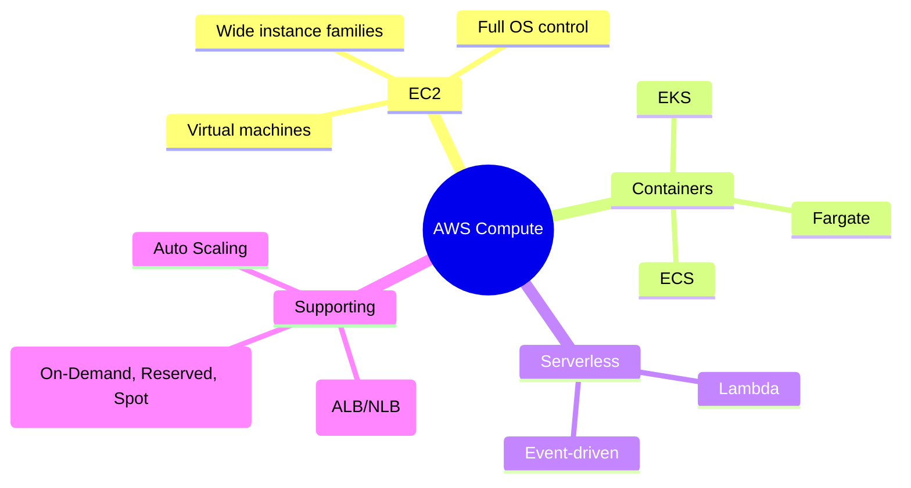

# Compute Overview

## Summary

- AWS provides multiple compute models—**virtual machines (EC2), containers (ECS/EKS/Fargate), and serverless (Lambda)**—so you can choose the right abstraction for each workload.
- The main trade‑offs are **control vs. operational overhead vs. agility**: EC2 gives maximum control, containers balance portability and efficiency, Lambda maximizes agility and reduces ops.
- Pricing and scaling options (On‑Demand, Reserved, Spot, Auto Scaling) strongly affect cost and reliability, so they are part of the compute decision, not an afterthought.

## Compute landscape (mindmap)

## Best Practices

- Use **EC2** when you need full OS control, specialized configurations, or long‑running workloads (including GPU/benchmarking).
- Use **containers (ECS/EKS, ideally with Fargate)** for microservices and portable workloads where you want a balance between control and abstraction.
- Use **Lambda** for event‑driven, spiky, or low‑throughput workloads where you want near‑zero operational overhead and fine‑grained cost.
- Combine **Auto Scaling + load balancers (ALB/NLB)** to handle variable demand and improve availability, instead of over‑provisioning a fixed fleet.
- Mix **pricing models**: On‑Demand for unpredictable usage, Reserved/Savings Plans for steady state, and Spot for fault‑tolerant/batch workloads.

## Exam Notes

- Be able to map exam scenarios to the right compute option:
  - Full OS control, legacy app migration → **EC2**.
  - Microservices or Kubernetes adoption → **ECS/EKS + Fargate/EC2**.
  - Event‑driven, unpredictable load, cost‑sensitive → **Lambda**.
- Understand the basics of **Auto Scaling**, **ALB vs NLB**, and **On‑Demand vs Reserved vs Spot** at a conceptual level (you don’t need exact prices).

## AWS documentation

- [Compute services on AWS](https://docs.aws.amazon.com/whitepapers/latest/aws-overview/compute-services.html)

## Related docs in this Hub

- [EC2 (virtual servers)](../03-services/compute/ec2/index.md)
- [Lambda (serverless compute)](../03-services/compute/lambda/index.md)
- [ECS](../03-services/compute/ecs/index.md) / [EKS](../03-services/compute/eks/index.md) / [Fargate](../03-services/compute/fargate/index.md)
