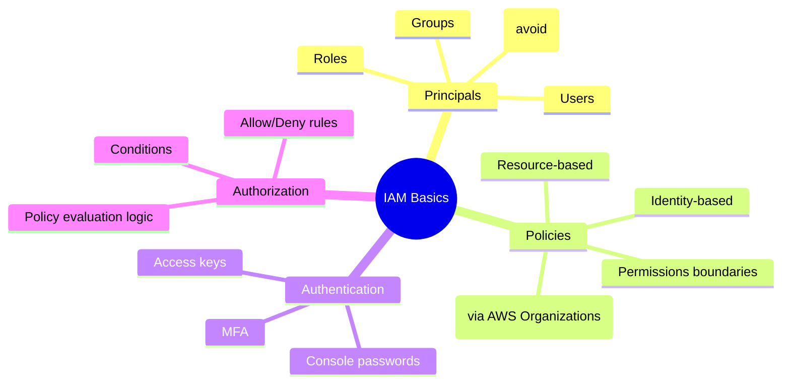

# IAM Basics

## Summary

- AWS Identity and Access Management (IAM) controls **who can do what, on which resources, under which conditions** across your AWS accounts.
- Core building blocks are **principals (users/roles), policies, and permissions boundaries**, which together implement least‑privilege access.
- A strong IAM foundation is critical for security and multi‑account governance, and is heavily tested in AWS exams.

## IAM concepts (mindmap)

## Best Practices

- Avoid using the **root user** except for a few account‑level tasks; secure it with MFA and strong credentials.
- Prefer **IAM Roles** over long‑lived access keys; assign roles to EC2, Lambda, ECS tasks, and use temporary credentials (STS).
- Implement **least privilege**: grant only the actions and resources required, and use conditions (for example, `aws:RequestedRegion`, `aws:MultiFactorAuthPresent`) where appropriate.
- Use **groups and role‑based access** for humans; avoid attaching policies directly to individual IAM users.
- In multi‑account setups, use **AWS Organizations + SCPs** to enforce guardrails across accounts.

## Exam Notes

- Understand the difference between **users, groups, roles**, and when to use each.
- Know the types of policies (identity‑based, resource‑based, permissions boundaries, SCPs) and how IAM policy evaluation works (explicit deny wins).
- Expect questions that require choosing IAM Roles + MFA + least‑privilege policies over simpler but insecure options (wide `*` permissions, root user, access keys on instances).

## AWS documentation

- [What is IAM?](https://docs.aws.amazon.com/IAM/latest/UserGuide/introduction.html)

## Related docs in this Hub

- [Pricing & Billing](./pricing-billing.md) (permissions for billing visibility)
