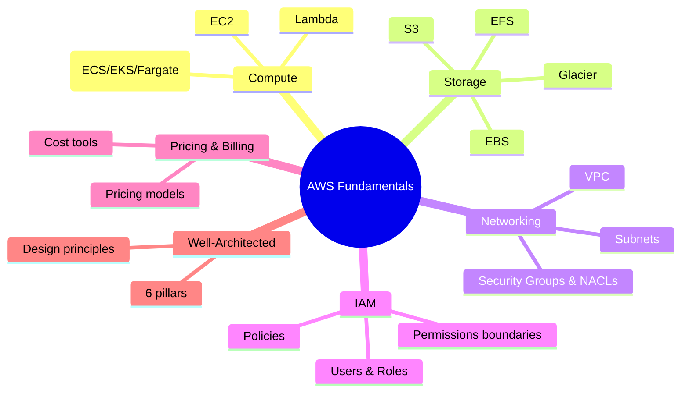

# AWS Fundamentals

## Summary

- This section covers the **core building blocks** you should understand before diving into individual AWS services: compute, storage, networking, IAM, pricing, and the Well-Architected Framework.
- The goal is to give you a **mental model of the platform** so you can reason about architectures, trade-offs, and costs, not just individual APIs.
- Once you’re comfortable here, you can move into service-specific clusters like `03-services` with much more confidence.

## Fundamentals map

## Best Practices

- Treat fundamentals as **shared knowledge**: whether you focus on compute, data, or security, you’ll repeatedly use these concepts.
- When reading, always ask: _“Where does this fit in the overall architecture? Which pillar of Well-Architected does it influence?”_
- Try to connect each fundamental topic with at least one **simple lab** (for example, create a VPC, configure a Security Group, launch EC2, store an object in S3).

## Topics in this section

- [Compute Overview](./compute-overview.md)
- [Storage Overview](./storage-overview.md)
- [Networking Overview](./networking-overview.md)
- [IAM Basics](./iam-basics.md)
- [Pricing & Billing](./pricing-billing.md)
- [Well-Architected Overview](./well-architected-overview.md)
