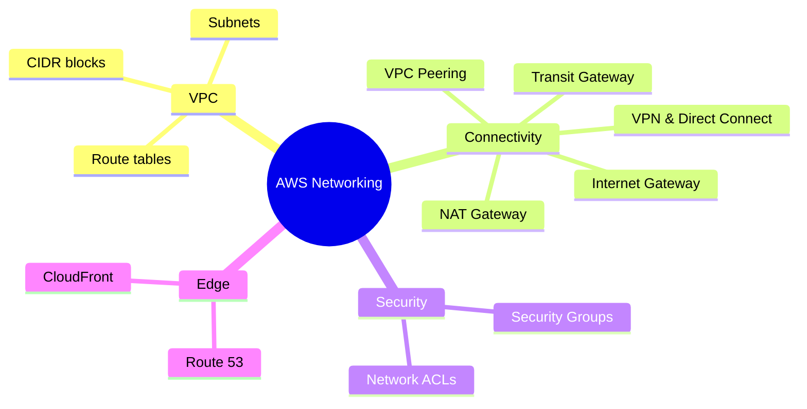

# Networking Overview

## Summary

- AWS networking fundamentals center around **VPC, subnets, route tables, Internet/NAT Gateways, Security Groups, and Network ACLs**.
- These components define how resources communicate **within AWS, with on‑premises, and with the public internet**, and are core to security and availability.
- A solid grasp of VPC networking is essential before designing production architectures or taking most AWS certifications.

## Networking landscape (mindmap)

## Best Practices

- Design **VPCs and subnets** explicitly (CIDR planning, public vs private subnets) instead of relying on the default VPC for production workloads.
- Use **Security Groups as the primary firewall**, keeping rules least‑privilege and referencing other Security Groups rather than wide CIDR ranges.
- Use **Network ACLs** as a stateless, subnet‑level guardrail for extra protection in sensitive environments.
- For outbound‑only internet from private subnets, use **NAT Gateways**; expose only load balancers/bastion hosts in public subnets.
- Centralize or simplify **inter‑VPC connectivity** using VPC Peering or **Transit Gateway**, especially in multi‑account environments.

## Exam Notes

- Be ready to distinguish **Security Groups (stateful, instance/ENI‑level)** from **NACLs (stateless, subnet‑level)** and choose the right one per scenario.
- Understand typical patterns: public subnet + IGW for internet‑facing resources, private subnets + NAT for app/DB tiers, VPN/Direct Connect for hybrid connectivity.
- Expect questions that hide networking issues behind symptoms (no internet, cannot connect between instances, high latency) where the fix is in **SG/NACL/route table** configuration.

## AWS documentation

- [Amazon VPC User Guide](https://docs.aws.amazon.com/vpc/latest/userguide/what-is-amazon-vpc.html)

## Related docs in this Hub

- [AWS Global Infrastructure](../01-introduction/aws-global-infrastructure.md)
