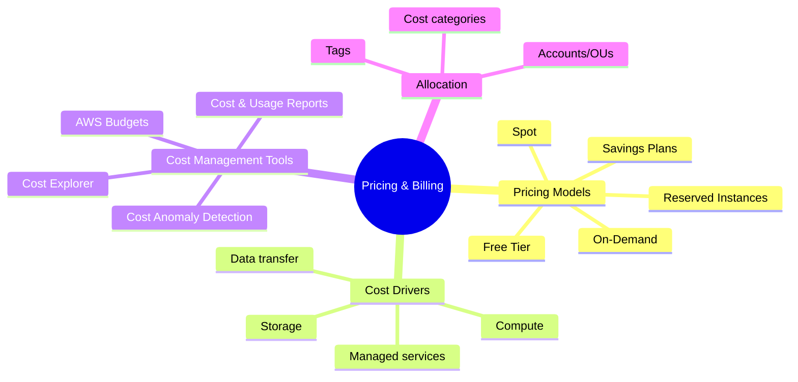

# Pricing & Billing

## Summary

- AWS pricing is primarily **pay-as-you-go**, with options like **On-Demand, Reserved Instances/Savings Plans, and Spot** to match different workload patterns.
- Understanding cost drivers (compute, storage, data transfer) and cost management tools is essential to avoid surprises and design cost-efficient architectures.
- Billing visibility and tagging strategy are as important as technical design for long-term cloud success.

## Pricing & billing overview (mindmap)

## Best Practices

- Start with **tagging** (Environment, Project, Owner, CostCenter) so you can break down costs by workload and team from day one.
- Use **Cost Explorer and AWS Budgets** to track trends and set alerts; enable **Cost Anomaly Detection** for early warning of unusual spend.
- Mix pricing models: On-Demand for unpredictable workloads, Reserved Instances/Savings Plans for stable baselines, and Spot for fault-tolerant workloads.
- Understand **data transfer pricing** (especially cross-Region and internet egress) and design architectures to minimize unnecessary traffic.
- Review bills monthly and **cleanup idle resources** (stopped-but-forgotten instances, unattached EBS volumes, unused Elastic IPs, old snapshots).

## Exam Notes

- Be comfortable picking the right **pricing model** given a scenario (steady vs spiky workloads, tolerance for interruption, long-term commitments).
- Know which **cost tools** are used for what: Cost Explorer (analysis), Budgets (alerts), Cost & Usage Reports (detailed data), Trusted Advisor and RI/SP recommendations (optimization).
- Remember that **Free Tier** is limited in time and usage; exam scenarios sometimes mention it for small experiments or POCs.

## AWS documentation

- [How AWS Pricing Works](https://docs.aws.amazon.com/whitepapers/latest/how-aws-pricing-works/how-aws-pricing-works.html)
- [AWS Cost Management](https://docs.aws.amazon.com/cost-management/index.html)
