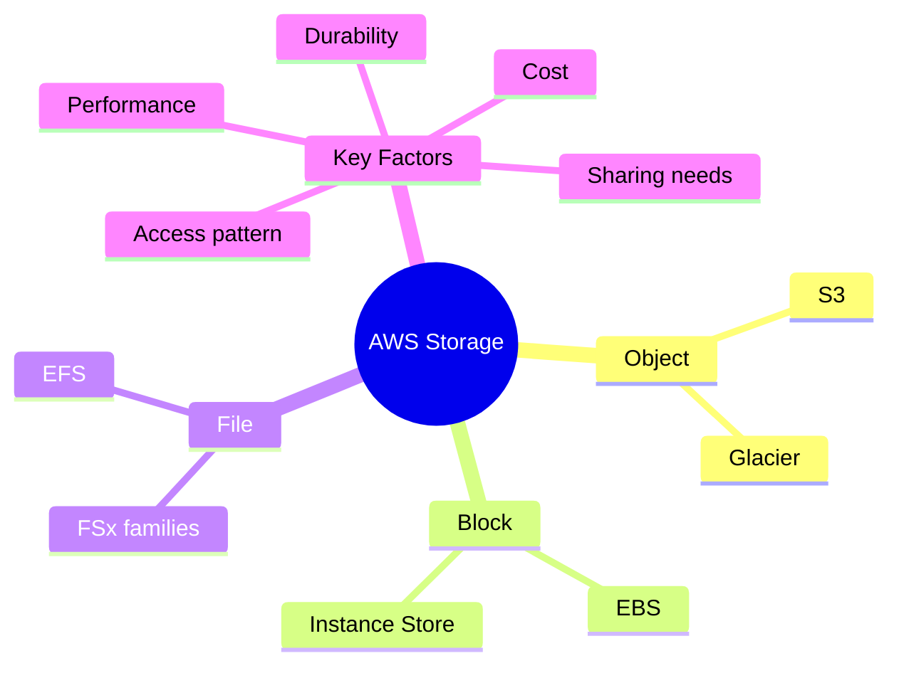

# Storage Overview

## Summary

- AWS storage services cover **object (S3), block (EBS), file (EFS/FSx), and archive (Glacier)** use cases, each optimized for different access patterns and durability needs.
- Picking the right storage type is about **access pattern, performance, durability, cost, and sharing requirements** (single instance vs many, POSIX vs object, hot vs cold data).
- Many architectures mix multiple storage options—e.g., EC2 with EBS + S3 for backups + EFS/FSx for shared state.

## Storage landscape (mindmap)

## Best Practices

- Use **S3** as the default choice for object storage, data lakes, backups, and static assets; leverage storage classes (Standard, IA, Glacier) to optimize cost.
- Use **EBS** as primary block storage for EC2, choosing volume types (gp3, io1/io2, st1, sc1) based on IOPS/throughput and cost; avoid storing critical data solely on instance store.
- Use **EFS or FSx** when multiple EC2 instances need to share a POSIX‑compatible file system (web content, home directories, shared app data).
- Implement **lifecycle policies, versioning, and replication** (S3 Lifecycle, EBS snapshots, cross‑Region replication) according to RPO/RTO and compliance requirements.
- Regularly review and clean up **unused volumes, snapshots, and buckets** and right‑size volumes and storage classes to manage cost.

## Exam Notes

- Know when to choose:
  - **S3** vs **EFS/FSx** (object vs file, access patterns, sharing).
  - **EBS** vs **instance store** (persistent vs ephemeral).
  - **S3 Standard/IA/One Zone/Glacier** for different cost vs durability needs.
- Understand the basics of **EBS volume types**, S3 durability, and snapshot behavior (incremental, stored in S3, cross‑Region copies).

## AWS documentation

- [AWS storage services](https://docs.aws.amazon.com/whitepapers/latest/aws-overview/storage-services.html)

## Related docs in this Hub

- [EC2 Storage](../03-services/compute/ec2/storage.md)
