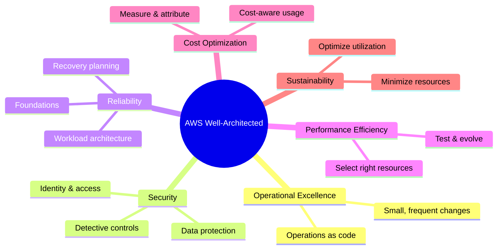

# Well-Architected Overview

## Summary

- The **AWS Well-Architected Framework** defines a set of pillars and principles for building secure, reliable, efficient, cost-effective, and sustainable workloads in the cloud.
- It provides a common language and checklist to review architectures, identify risks, and prioritize improvements.
- Many exam questions are essentially Well-Architected questions framed as scenarios.

## Pillars (mindmap)

## Best Practices

- Use the framework as a **review tool**, not just a document—run regular Well-Architected reviews on key workloads.
- Tie design decisions back to pillars (for example, Multi-AZ + Auto Scaling → Reliability; managed services + automation → Operational Excellence).
- Capture risks and improvement items from reviews and track them like normal engineering work (backlog, owners, deadlines).
- For new workloads, use **Well-Architected as a design checklist** before implementation, not only as a post-mortem.

## Exam Notes

- Know the **names and high-level focus** of each pillar and be able to map design choices to them.
- Many questions that mention *monitoring, automation, game days* → Operational Excellence; *MFA, encryption, least privilege* → Security; *Multi-AZ, backups, DR* → Reliability; *right-sizing, Spot, shutdown schedules* → Cost Optimization; *serverless, efficient resource use* → Performance & Sustainability.
- In ambiguous cases, the “most Well-Architected” answer is usually the correct one.

## AWS documentation

- [AWS Well-Architected Framework](https://docs.aws.amazon.com/wellarchitected/latest/framework/wellarchitected-framework.html)
