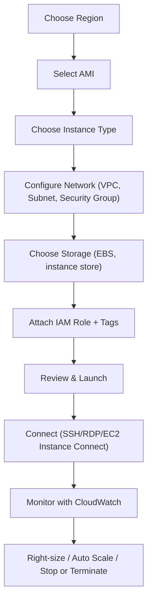
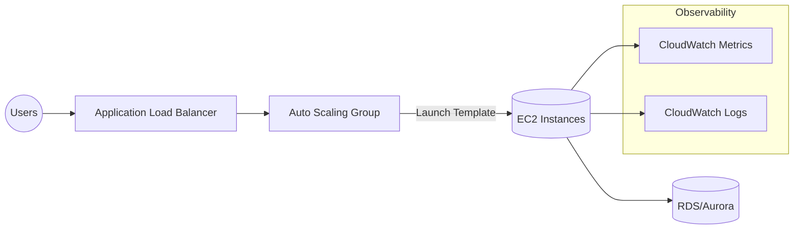
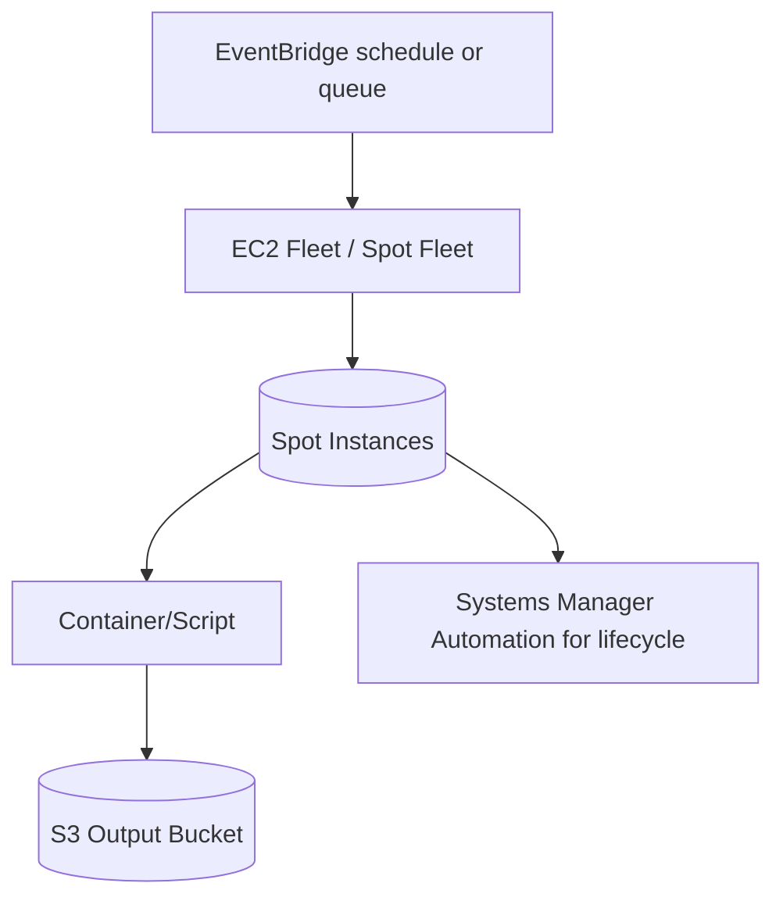

# EC2 Basics

## Summary

- Launching EC2 safely and efficiently means following a clear flow: **choose AMI and instance type → configure network and security → attach storage → tag → launch and connect → monitor and adjust**.
- You can access EC2 via the console, CLI, SDKs, or Infrastructure as Code tools (CloudFormation/Terraform), but the core concepts (AMI, instance type, VPC, Security Group, key pair) are the same.
- Good day‑0 setup (IAM Role, Security Groups, tags, monitoring) dramatically simplifies day‑2 operations (patching, scaling, troubleshooting, cost control).

## Service at a Glance

| Choose EC2 when you need… | Consider alternatives when… |
| --- | --- |
| Full control of OS, networking, placement groups, and licensing requirements. | You only need managed containers or serverless runtimes (ECS Fargate, Lambda). |
| Custom images or agents that require root access and kernel tweaks. | You want a fully managed database, analytics, or event-driven service instead of self-managing software on EC2. |
| Lift-and-shift migrations where apps expect persistent hosts. | The workload is bursty, stateless, and better served by AWS App Runner/EKS with autoscaling pods. |

## Launch & manage EC2 instances (flow)

## Architecture Variants

### Web tier with Auto Scaling + ALB

### Batch/Compute farm with Spot Fleets

## Best Practices

- **Standardize how you launch instances** using Launch Templates or IaC instead of ad‑hoc console clicks; this ensures consistent AMIs, Security Groups, IAM Roles, and tags.
- Always use an **IAM Role** for applications that call AWS APIs; never store long‑lived access keys on the instance.
- **Lock down Security Groups** to only required ports and trusted sources (e.g. your office IP for SSH/RDP), and separate groups per tier (web/app/db).
- **Separate OS and data** into different volumes, enable EBS encryption, and use snapshots or AWS Backup for regular, automated backups.
- Turn on **monitoring and logging from day one** (detailed monitoring, CloudWatch Logs) and set basic alarms for CPU, status checks, disk, and network.
- Manage lifecycle: stop or terminate unused instances, and ensure every instance has **meaningful tags** (Environment, Owner, Project, CostCenter).

## Operations & Cost Lens

| Operations Focus | Why it matters | Cost Lens | Optimization idea |
| --- | --- | --- | --- |
| Patch management & AMI hygiene | Golden AMIs + SSM Patch Manager reduce drift and downtime. | Pricing model choice | Mix Savings Plans/Reserved Instances for steady workloads; keep dev/test on On-Demand or Spot. |
| Monitoring & remediation | CloudWatch + EventBridge or Incident Manager detect/auto-remediate failures. | Storage lifecycle | Use gp3/EBS Snapshots Archive and delete unattached volumes or idle Elastic IPs. |
| Access control & secrets | Use IAM Roles, Parameter Store, Secrets Manager instead of local files. | Instance right-sizing | Review Cost Explorer / Compute Optimizer monthly to downsize or switch families. |

## Hands-on Hook

- Ready to practice? Jump to the [Auto Scaling EC2 with ALB lab](../../../05-labs/ec2-lab.md) for a guided walkthrough using Launch Templates, Target Groups, and CloudWatch alarms.

## Certification Focus

- **CLF-C02 Domain 2 – Security & Compliance**: Spot insecure defaults like wide-open Security Groups or hard-coded keys.
- **SAA-C03 Domain 2 & 3 – Design Resilient and High-Performing Architectures**: Map Auto Scaling + ALB patterns and storage decisions to scenario-based questions.
- **DVA-C02 Domain 1 – Deployment**: Know when to use EC2 vs. managed compute options in application stacks.

## Exam Notes

- Know the **Launch Instance wizard steps** and what each concept means (AMI, instance type, key pair, Security Group, VPC/subnet, storage, tags).
- Understand the different ways to connect to EC2 (SSH, RDP, EC2 Instance Connect, Systems Manager Session Manager) and when AWS recommends each.
- Remember what happens to **EBS vs instance store data** when stopping or terminating an instance, and how billing behaves in each state.
- IAM Role + Security Group + private subnets are the “safe default” design in most exam scenarios; hard‑coded credentials or wide‑open SGs are almost always wrong.

## AWS documentation

- [Get started with Amazon EC2](https://docs.aws.amazon.com/AWSEC2/latest/UserGuide/EC2_GetStarted.html)

## Related docs in this Hub

- [EC2 Instance Types](./instance-types.md)
- [EC2 Networking](./networking.md)
- [EC2 Storage](./storage.md)
- [EC2 Best Practices](./best-practices.md)
