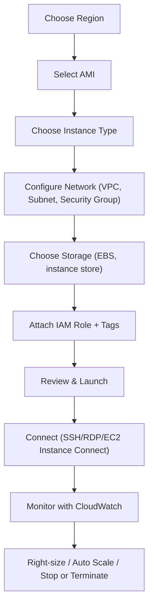

# EC2 Basics

## Summary

- Launching EC2 safely and efficiently means following a clear flow: **choose AMI and instance type → configure network and security → attach storage → tag → launch and connect → monitor and adjust**.
- You can access EC2 via the console, CLI, SDKs, or Infrastructure as Code tools (CloudFormation/Terraform), but the core concepts (AMI, instance type, VPC, Security Group, key pair) are the same.
- Good day‑0 setup (IAM Role, Security Groups, tags, monitoring) dramatically simplifies day‑2 operations (patching, scaling, troubleshooting, cost control).

## Launch & manage EC2 instances (flow)

## Best Practices

- **Standardize how you launch instances** using Launch Templates or IaC instead of ad‑hoc console clicks; this ensures consistent AMIs, Security Groups, IAM Roles, and tags.
- Always use an **IAM Role** for applications that call AWS APIs; never store long‑lived access keys on the instance.
- **Lock down Security Groups** to only required ports and trusted sources (e.g. your office IP for SSH/RDP), and separate groups per tier (web/app/db).
- **Separate OS and data** into different volumes, enable EBS encryption, and use snapshots or AWS Backup for regular, automated backups.
- Turn on **monitoring and logging from day one** (detailed monitoring, CloudWatch Logs) and set basic alarms for CPU, status checks, disk, and network.
- Manage lifecycle: stop or terminate unused instances, and ensure every instance has **meaningful tags** (Environment, Owner, Project, CostCenter).

## Exam Notes

- Know the **Launch Instance wizard steps** and what each concept means (AMI, instance type, key pair, Security Group, VPC/subnet, storage, tags).
- Understand the different ways to connect to EC2 (SSH, RDP, EC2 Instance Connect, Systems Manager Session Manager) and when AWS recommends each.
- Remember what happens to **EBS vs instance store data** when stopping or terminating an instance, and how billing behaves in each state.
- IAM Role + Security Group + private subnets are the “safe default” design in most exam scenarios; hard‑coded credentials or wide‑open SGs are almost always wrong.

## AWS documentation

- [Get started with Amazon EC2](https://docs.aws.amazon.com/AWSEC2/latest/UserGuide/EC2_GetStarted.html)

## Related docs in this Hub

- [EC2 Instance Types](./instance-types.md)
- [EC2 Networking](./networking.md)
- [EC2 Storage](./storage.md)
- [EC2 Best Practices](./best-practices.md)
