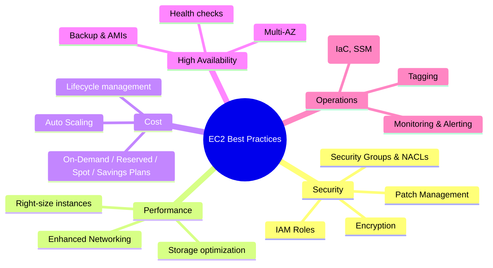

# EC2 Best Practices

## Summary

- EC2 best practices focus on **security**, **performance**, **cost**, **availability**, and **operations**, ensuring your environment is safe, efficient, and easy to run at scale.
- Core patterns include: using **IAM Roles** instead of access keys, designing **VPC and Security Groups** correctly, **right‑sizing** instances, leveraging **Auto Scaling + Multi‑AZ**, and automating backups and patching.
- Strong tagging, logging and monitoring, plus tested DR procedures, are key for long‑term operational excellence.

## EC2 best practices mindmap

## Best Practices

- **Security**

  - Use **IAM Roles** (not embedded access keys) for EC2 applications that call AWS APIs.
  - Design **Security Groups** with least privilege, split by function (web/app/db), and review rules regularly; layer **Network ACLs** where needed.
  - Enable **EBS encryption** and encrypt sensitive data in transit with TLS; use KMS for key management.
  - Automate **patching** via Systems Manager Patch Manager with defined maintenance windows.

- **Performance**

  - **Right‑size instances** and use current‑generation types; monitor CPU, memory, I/O, and network in CloudWatch.
  - Turn on **enhanced networking** for network‑intensive workloads; consider placement groups if you need very low latency between instances.
  - Match **EBS volume type** to workload (gp3, io1/io2, st1, sc1) and reserve instance store for fast, temporary data.

- **Cost Optimization**

  - Combine **On‑Demand, Reserved Instances/Savings Plans, and Spot** based on workload predictability and fault‑tolerance.
  - Use **Auto Scaling** to adjust capacity with demand instead of running peak capacity 24/7.
  - Implement lifecycle management: stop or terminate unused instances, delete unattached volumes and stale snapshots, and tag everything for cost allocation.

- **High Availability & DR**

  - Deploy across **multiple AZs** using Auto Scaling Groups and load balancers for the web/app tier; use Multi‑AZ options for critical data stores.
  - Define and monitor **health checks** (system, instance, application) and automate recovery actions.
  - Use **EBS snapshots and golden AMIs**, test restores regularly, and replicate to other Regions when required.

- **Operations & Monitoring**
  - Configure **CloudWatch metrics, dashboards, and alarms** for infrastructure and application KPIs.
  - Centralize logs with **CloudWatch Logs** and apply retention policies; integrate with alerting channels (email, Slack, etc.).
  - Use **Infrastructure as Code** (CloudFormation/Terraform) and **Systems Manager** for automation, and maintain up‑to‑date runbooks and documentation.

## Exam Notes

- In exam scenarios, the “AWS‑recommended” answer usually combines: **IAM Role + Security Group + Multi‑AZ + Auto Scaling + EBS encryption + monitoring/logging**.
- Understand how Security Groups and NACLs interact, and when AWS suggests one vs the other; SGs are the primary control in most designs.
- For cost questions, prefer **Reserved/Savings Plans** for steady workloads, **Spot** for batch or fault‑tolerant jobs, and always mention **right‑sizing** and cleaning up unused resources.
- High‑availability questions often expect **Multi‑AZ design with load balancers and Auto Scaling**, not single instances in a single AZ.

## AWS documentation

- [Security in Amazon EC2](https://docs.aws.amazon.com/AWSEC2/latest/UserGuide/ec2-security.html)
- [Amazon EC2 best practices](https://docs.aws.amazon.com/AWSEC2/latest/UserGuide/ec2-best-practices.html)

## Related docs in this Hub

- [EC2 Basics](./basics.md)
- [EC2 Cost Optimization](./cost-optimization.md)
- [EC2 Troubleshooting](./troubleshooting.md)
