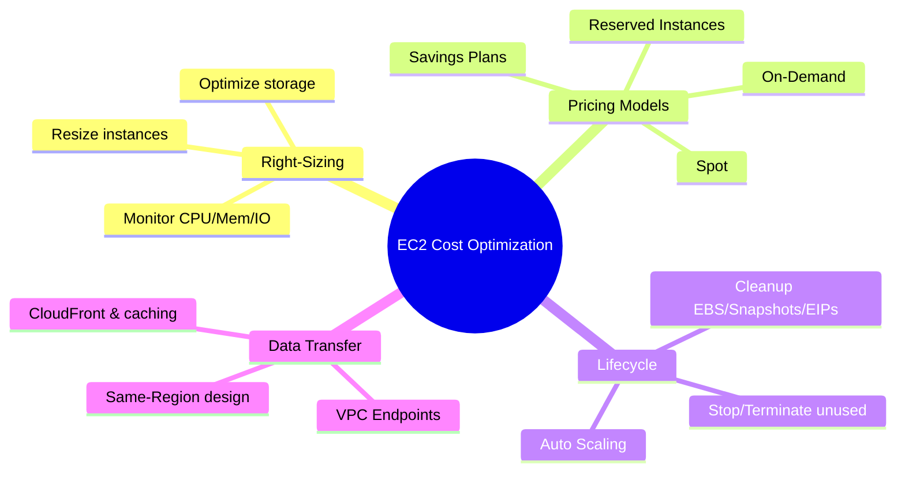

# EC2 Cost Optimization

## Summary

- EC2 can dominate your AWS bill; costs come from **compute (instances)**, **storage (EBS, snapshots)**, **data transfer**, and supporting services (NAT, load balancers, etc.).
- AWS offers several **pricing models** (On‑Demand, Reserved Instances, Spot, Savings Plans) so you can align cost with workload predictability and fault tolerance.
- Effective optimization combines **right‑sizing**, **selecting the right pricing model**, and **good lifecycle/data‑transfer management** (Auto Scaling, stopping/terminating, and minimizing cross‑Region/Internet traffic).

## Cost optimization strategy mindmap

## Best Practices

- **Right‑size before you commit**: collect 2–4 weeks of utilization data (CPU, memory, network, disk) and shrink or change instance types and EBS volumes before buying RIs/Savings Plans.
- **Layer pricing models**:
  - Predictable baseline → **Reserved Instances/Savings Plans**.
  - Batch, CI/CD, ML experiments → **Spot Instances**.
  - Short‑lived or experimental → **On‑Demand**.
- Use **Auto Scaling** instead of static fleets; scale‑in during low‑demand hours to avoid paying for unused capacity.
- Optimize **storage costs** by preferring gp3, using io1/io2 only when required, cleaning up unattached EBS volumes, and pruning old snapshots with lifecycle policies.
- Reduce **data transfer cost** by keeping traffic in the same Region/AZ, using **VPC endpoints** for S3/DynamoDB, and leveraging **CloudFront** and caching to reduce internet egress.
- Implement a **tagging strategy** (Environment, Project, Owner, CostCenter) and use **AWS Budgets/Cost Explorer/Cost Anomaly Detection** to track and alert on spending.

## Exam Notes

- Understand the trade‑offs of each pricing model:
  - On‑Demand → maximum flexibility, highest hourly cost.
  - Reserved Instances / Savings Plans → up to ~72% savings for steady‑state workloads.
  - Spot → up to ~90% savings but can be interrupted (2‑minute warning).
- In exam questions, steady long‑running workloads usually point to **Reserved/Savings Plans**, while batch/CI pipelines suggest **Spot** and dev/test suggest **On‑Demand or Spot**.
- Remember that **stopped instances still incur EBS charges**, and idle **Elastic IPs** incur charges as well; both are common sources of avoidable cost.
- For cost management, AWS promotes **Cost Explorer, AWS Budgets, Cost Allocation Tags, and Cost Anomaly Detection** as first‑class tools.

## AWS documentation

- [Amazon EC2 pricing](https://aws.amazon.com/ec2/pricing/)
- [AWS Cost Management tools](https://docs.aws.amazon.com/cost-management/index.html)

## Related docs in this Hub

- [EC2 Best Practices](./best-practices.md)
- [EC2 Instance Types](./instance-types.md)
- [AWS Pricing & Billing](../../../02-fundamentals/pricing-billing.md)
