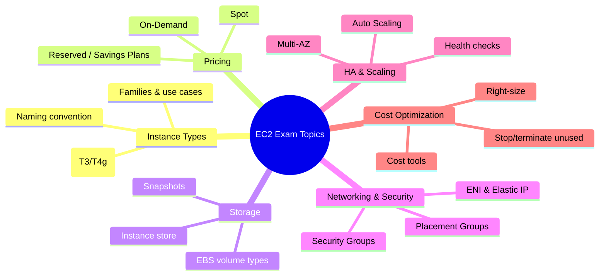

# EC2 Exam Notes

## Summary

- EC2 features heavily in AWS exams (SAA, DVA, SOA, SAP); key topics include **instance types & pricing models, storage, networking/security, high availability, and cost optimization**.
- Questions are scenario‑based and expect you to apply **Well‑Architected** principles (secure, reliable, performant, cost‑efficient) rather than memorize details only.
- Knowing the “AWS‑preferred” defaults (IAM Role, Security Group, Multi‑AZ, Auto Scaling, EBS encrypted, Spot for batch, etc.) helps quickly eliminate wrong answers.

## Exam topics mindmap

## Exam Notes by topic

- **Instance Types & Naming**

  - Families: **General Purpose (M, T)**, **Compute Optimized (C)**, **Memory Optimized (R, X, High Memory)**, **Storage Optimized (I, D, H)**, **Accelerated (P, G, Inf, Trn)**.
  - Naming: `[family][generation].[size]` (for example, `m6i.large`, `c7g.xlarge`).
  - T2/T3/T4g are **burstable**, use CPU credits; current‑generation types (M6/M7, C6/C7, R6/R7) are preferred over M4/C4/R4.

- **Pricing Models**

  - **On‑Demand**: pay per hour/second, no commitment, highest cost; use for variable, short‑term, or test workloads.
  - **Reserved Instances / Savings Plans**: 1–3‑year commitments, save up to ~72%; best for predictable, steady‑state workloads.
  - **Spot Instances**: up to ~90% discount, can be interrupted with 2‑minute notice; use for fault‑tolerant/batch/CI/ML training.

- **Storage**

  - EBS volume types:
    - `gp3` (general purpose SSD, baseline 3,000 IOPS, 125 MB/s; configurable up to 16,000 IOPS and 1,000 MB/s).
    - `io1/io2` (Provisioned IOPS SSD; io2 supports higher durability and IOPS, multi‑attach).
    - `st1` (throughput‑optimized HDD for big data, logs, sequential I/O).
    - `sc1` (cold HDD for infrequently accessed data).
  - **Instance store**: local, ephemeral, very fast; data is lost on stop/terminate; use for cache/scratch/temporary data, not for critical data.
  - **Snapshots**: incremental backups of EBS volumes, stored in S3 (hidden), can be copied across Regions/accounts and used to create new volumes.

- **Networking & Security**

  - **Security Groups**: stateful, instance‑level firewalls; deny‑all inbound / allow‑all outbound by default; allow rules based on IP/CIDR or other SGs.
  - **ENI**: Elastic Network Interface – multiple ENIs per instance, each with its own private IPs, Security Groups, and optional Elastic IP.
  - **Enhanced networking**: provides higher bandwidth, lower latency, more PPS; based on SR‑IOV (ENA) or EFA for HPC/ML.

- **Placement Groups**

  - **Cluster**: low latency, high throughput, single AZ; for tightly coupled HPC/ML workloads.
  - **Spread**: high availability, instances on distinct hardware; up to 7 instances per AZ; for small sets of critical instances.
  - **Partition**: for large distributed systems (Hadoop, Cassandra, Kafka); up to 7 partitions per AZ; isolates failures by partition.

- **High Availability & Scaling**

  - **Multi‑AZ deployment**: spread instances across AZs, use Auto Scaling and load balancers; design for AZ failures.
  - **Auto Scaling** components: Launch Template/Configuration, Auto Scaling Group, scaling policies (Target Tracking, Step, Simple), and health checks.
  - **Status checks**:
    - System status → host issues, fix by stop/start.
    - Instance status → OS/app/network configuration issues.

- **Security**

  - **IAM Roles for EC2**: AWS‑recommended method to grant AWS API access; temporary credentials, no static keys on instances.
  - **Encryption**: EBS encryption at rest with KMS, encrypted snapshots; TLS/HTTPS for data in transit, VPN/Direct Connect for secure connectivity.

- **Cost Optimization**
  - Key strategies: **right‑size instances**, use RIs/Savings Plans for predictable usage, Spot for fault‑tolerant workloads, Auto Scaling for elasticity, and stop/terminate unused resources.
  - Cost tools: **Cost Explorer, AWS Budgets, Cost Allocation Tags, RI/Savings Plans recommendations, Cost Anomaly Detection**.

## Exam Tips

- Read each scenario carefully, highlight clues like _steady usage, spiky traffic, must minimize cost, must be highly available, cannot tolerate downtime, must be fault‑tolerant_.
- Default to AWS best practices: **IAM Roles, Security Groups, Multi‑AZ + Auto Scaling + load balancer, EBS encryption, CloudWatch monitoring, DR with snapshots/AMIs**.
- Eliminate options that:
  - Expose ports widely without justification (e.g. `0.0.0.0/0` to SSH/RDP).
  - Hard‑code or store access keys on instances.
  - Use single instances in a single AZ for production high‑availability scenarios.
- Always balance **cost, performance, and availability**; the correct answer rarely maximizes just one of these.

## Related docs in this Hub

- [EC2 Basics](./basics.md)
- [EC2 Instance Types](./instance-types.md)
- [EC2 Best Practices](./best-practices.md)
- [EC2 Cost Optimization](./cost-optimization.md)
- [AWS Certification Exam Guides](../../../07-exam/index.md)
