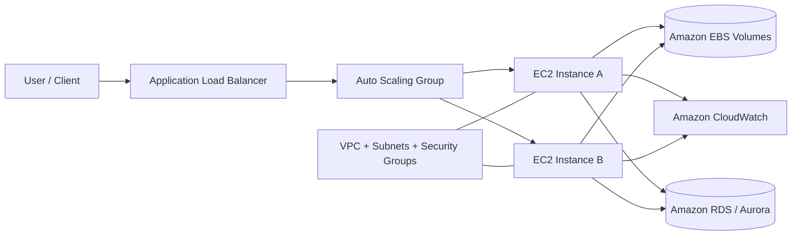

# Amazon EC2

## Summary

- **Amazon EC2** provides virtual servers (EC2 instances) in the AWS Cloud with elastic scale up/down, helping you reduce hardware costs and deploy applications faster.
- The **instance type** you choose defines CPU, memory, storage, and networking, so choosing the right type for your workload is critical.
- The EC2 ecosystem includes services like **Amazon EBS, VPC, Security Groups, IAM, Auto Scaling, Elastic Load Balancing, and CloudWatch** to secure, scale, and observe your workloads.
- Pricing models (On‑Demand, Reserved Instances, Spot, Savings Plans) have a major impact on cost; combining them with right‑sizing is key to optimization.

## Architecture diagram (EC2 in a typical web stack)

## Best Practices

- **Right-size your instances**: use CloudWatch metrics (CPU, memory, network, I/O) to choose the smallest instance type and size that comfortably meets your workload needs.
- **Use Auto Scaling with load balancers**: place EC2 instances in an Auto Scaling Group behind an Elastic Load Balancer to handle traffic spikes and improve high availability.
- **Harden networking with VPC and Security Groups**: keep application/database tiers in private subnets, restrict inbound rules to only what is necessary, and use security groups as sources instead of wide CIDR ranges.
- **Standardize AMIs and patching**: rely on golden AMIs and automated patching (AWS Systems Manager) to keep OS and agents up to date and reduce configuration drift.
- **Enable monitoring and logging**: send system and application logs to CloudWatch Logs, configure dashboards and alarms for CPU, status checks, disk, and network metrics.
- **Protect and back up data**: encrypt EBS volumes and snapshots by default, use scheduled snapshots (or AWS Backup), and regularly test restore procedures for disaster recovery.
- **Optimize cost proactively**: combine Savings Plans/Reserved Instances for steady usage, Spot Instances for fault‑tolerant/batch workloads, and regularly clean up idle EC2, EBS volumes, Elastic IPs, and old snapshots.

## Exam Notes

- Understand the **EC2 instance lifecycle** (pending → running → stopping/stopped → shutting‑down → terminated) and how it affects billing, EBS, and instance store data.
- Be able to distinguish **pricing models** (On‑Demand, Reserved Instances, Spot, Savings Plans) and choose the right one in scenarios about long‑running, bursty, or batch workloads.
- Know the difference between **EBS volumes** (persistent, network‑attached) and **instance store** (ephemeral, local) and common volume types (gp3, io1/io2, st1, sc1).
- Understand the role of **Security Groups (stateful)** and **Network ACLs (stateless)**, and how they work with VPC, subnets, and Internet/NAT Gateways.
- Recognize standard patterns for **high availability** on EC2: Multi‑AZ, Auto Scaling Groups, and load balancers for web/app tiers, and Multi‑AZ databases when needed.

## AWS documentation

- [What is Amazon EC2?](https://docs.aws.amazon.com/AWSEC2/latest/UserGuide/concepts.html)
- [Get started with Amazon EC2](https://docs.aws.amazon.com/AWSEC2/latest/UserGuide/EC2_GetStarted.html)

## Related docs in this Hub

- [EC2 Basics](./basics.md)
- [Instance Types](./instance-types.md)
- [Networking](./networking.md)
- [Storage](./storage.md)
- [Placement Groups](./placement-groups.md)
- [Best Practices](./best-practices.md)
- [Cost Optimization](./cost-optimization.md)
- [Troubleshooting](./troubleshooting.md)
- [Exam Notes](./exam-notes.md)
