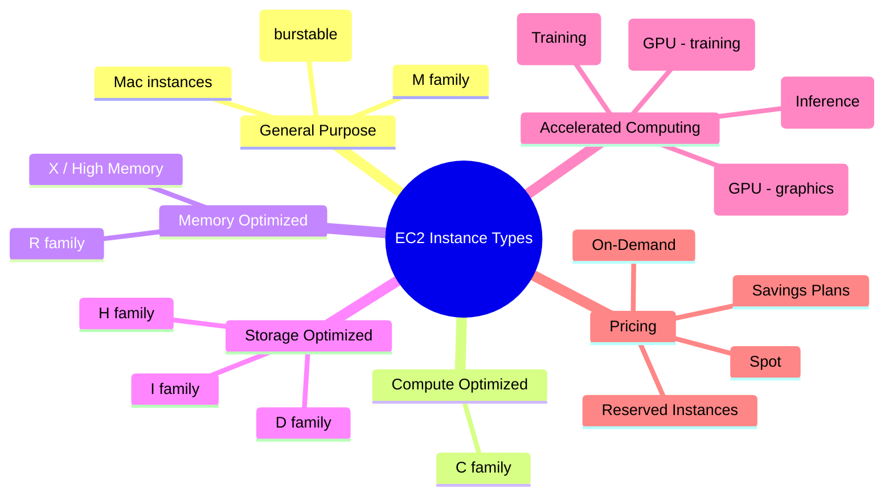

# EC2 Instance Types

## Summary

- The **instance type** controls vCPU, memory, storage, and networking for an EC2 instance, so choosing the right type is essential for both performance and cost.
- Amazon EC2 provides multiple **instance families** (General Purpose, Compute Optimized, Memory Optimized, Storage Optimized, Accelerated Computing, etc.) tuned for specific workload characteristics.
- Each family has several **generations and sizes**; you should prefer current‑generation types (M6/M7, C6/C7, R6/R7, etc.) for better price/performance and feature support.
- A good cost strategy combines **right‑sizing** with the right pricing model (On‑Demand, Reserved, Spot, Savings Plans).

## Instance type mindmap

## Best Practices

- **Start from the workload, not the instance name**: describe whether it is CPU‑bound, memory‑bound, I/O‑bound, or GPU‑heavy and pick the family accordingly instead of defaulting to a familiar type.
- Prefer **current‑generation families** (M6/M7, C6/C7, R6/R7, etc.) to get better performance and usually lower cost per unit of performance than older generations.
- Use **burstable instances (T3/T4g)** for light or variable workloads that do not need sustained high CPU; monitor CPU credits to avoid throttling.
- **Separate special workloads**: use R*/X*/High Memory for large databases, I*/D*/H*for big data/analytics, and P*/G*/Inf*/Trn*for ML/HPC rather than forcing everything onto M*.
- **Right‑size regularly**: at least each quarter, review CPU/memory/I/O metrics, downsize or split under‑utilized instances, and consider Spot/Savings Plans for stable portions of usage.
- Combine instance types with **appropriate pricing models**: steady workloads → Reserved/Savings Plans; batch/CI/ML experiments → Spot; dev/test → On‑Demand or Spot.

## Exam Notes

- Remember the **naming pattern**: `[family][generation].[size]` (for example, `m6i.large`, `c7g.xlarge`) and map families to primary use cases:
  - General Purpose (M, T, Mac) – balanced workloads.
  - Compute Optimized (C) – CPU‑intensive.
  - Memory Optimized (R, X, High Memory) – in‑memory DB, caches.
  - Storage Optimized (I, D, H) – high throughput/I/O.
  - Accelerated (P, G, Inf, Trn) – GPU/ML/HPC.
- Exams (especially SAA/DVA) frequently test on **burstable instances** (T2/T3/T4g and CPU credits), current vs previous generations, instance store vs EBS, and features like EBS‑optimized/enhanced networking.
- Know the highlights of the **Nitro System** (better performance, stronger isolation, enhanced networking) and when a **metal instance** is needed (bare‑metal access, specific licensing).
- In cost questions, link instance selection to pricing models (for example, `c6i` with Reserved or Savings Plans for a compute‑intensive, predictable workload).

## AWS documentation

- [Amazon EC2 instance types](https://docs.aws.amazon.com/AWSEC2/latest/UserGuide/instance-types.html)
- [Amazon EC2 Instance Types Guide](https://docs.aws.amazon.com/ec2/latest/instancetypes/instance-types.html)

## Related docs in this Hub

- [EC2 Basics](./basics.md)
- [EC2 Cost Optimization](./cost-optimization.md)
- [EC2 Best Practices](./best-practices.md)
