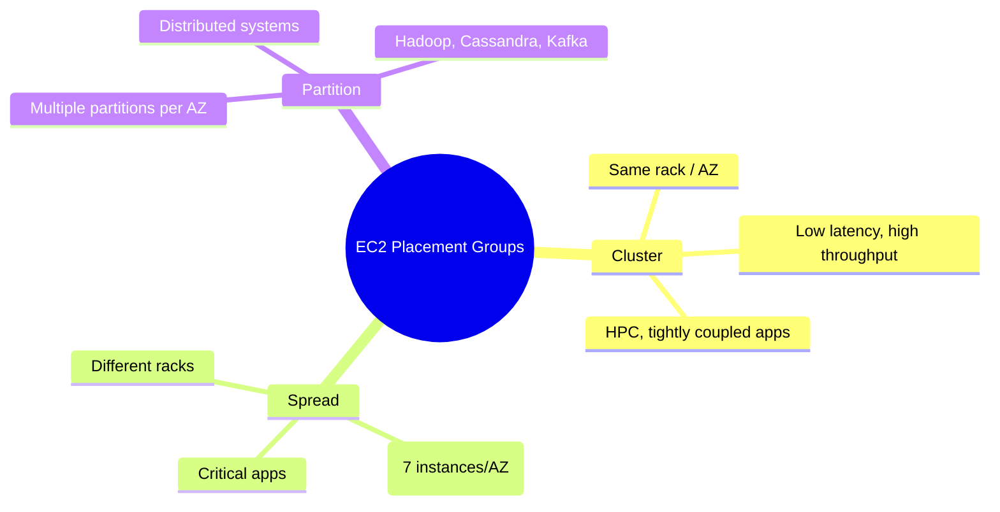

# EC2 Placement Groups

## Summary

- A **placement group** controls how EC2 instances are placed on underlying hardware to optimize either **network performance** or **availability**.
- There are three types: **Cluster** (low‑latency, high throughput within one AZ), **Spread** (maximum instance‑level isolation), and **Partition** (group‑level isolation for large distributed systems).
- Choosing the right placement group can significantly improve performance characteristics or reduce correlated failure risk without changing your application logic.

## Placement group comparison

## Best Practices

- **Plan placement groups up front**: you cannot change the type later, so decide Cluster/Spread/Partition during architecture design, not after deployment.
- **Cluster placement group**: use for HPC, ML training, and tightly coupled workloads that require very low latency and high throughput; combine with enhanced networking and compatible instance types.
- **Spread placement group**: use for a small number of **critical instances** that must not share hardware and need maximum isolation (up to 7 per AZ).
- **Partition placement group**: use for big distributed systems where failures should be isolated at the partition level (Hadoop, Cassandra, Kafka); design the application to be partition‑aware.
- Always **monitor network metrics** (latency, throughput, packet loss) and status checks; placement groups do not remove the need for resilient application design.
- Remember that placement groups are **free**, but the wrong type can increase risk (e.g. single‑AZ Cluster) or limit scale (Spread instance cap).

## Exam Notes

- Many questions ask you to **pick the correct placement group type** for a scenario:
  - Tight, low‑latency communication within one AZ → **Cluster**.
  - A few critical instances needing maximum hardware isolation → **Spread**.
  - Hundreds of nodes in a distributed store/analytics cluster → **Partition**.
- Memorize key limits: **Spread ≤ 7 instances per AZ**, **Partition ≤ 7 partitions per AZ**, and Cluster is **single‑AZ only**.
- Placement groups do **not replace Multi‑AZ or Multi‑Region DR**; Cluster can actually increase blast radius if the AZ fails.
- Capacity/instance‑type constraints can prevent launches into a placement group; that is a common pitfall in exam scenarios.

## AWS documentation

- [Placement groups](https://docs.aws.amazon.com/AWSEC2/latest/UserGuide/placement-groups.html)

## Related docs in this Hub

- [EC2 Basics](./basics.md)
- [EC2 Networking](./networking.md)
- [EC2 Best Practices](./best-practices.md)
