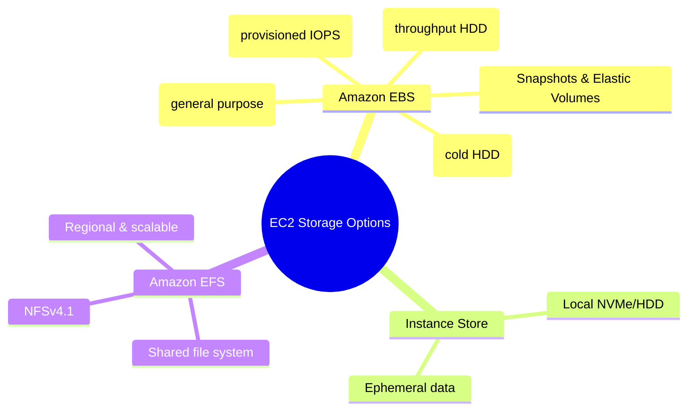

# EC2 Storage Options

## Summary

- EC2 supports multiple storage options: **Amazon EBS (persistent block storage)**, **instance store (local ephemeral)**, and **Amazon EFS (shared file system)**; each is ideal for different workload patterns.
- **Amazon EBS** is the default choice for most workloads; you pick between gp3, io1/io2, st1, sc1 based on IOPS/throughput needs and cost.
- **Instance store** offers extremely high performance but loses data when the instance stops or terminates, so it should only be used for temporary data.
- **Amazon EFS** provides a scalable, shared POSIX file system that can be mounted by many EC2 instances, suitable for shared content and application data.

## Storage options at a glance

## Best Practices

- Use **gp3 as the default** volume type for most workloads; tune IOPS and throughput as needed instead of relying on older gp2.
- Reserve **io1/io2** for workloads that truly require high, consistent IOPS (typically relational or NoSQL databases), and monitor CloudWatch volume metrics to avoid over‑provisioning.
- Never store critical data exclusively on **instance store**; back important data up to EBS or S3 and understand that data is lost when the instance stops or terminates.
- **Separate OS and data** volumes, enable EBS encryption, and use Data Lifecycle Manager or AWS Backup to schedule snapshots with appropriate retention policies.
- For workloads requiring shared file storage across instances, use **Amazon EFS** and select the right performance and throughput modes (General Purpose vs Max I/O, Bursting vs Provisioned).
- Regularly **clean up unused EBS volumes and snapshots** and right‑size volumes to keep storage costs under control.

## Exam Notes

- Know when to choose each EBS type: **gp3** (default, flexible IOPS/throughput), **io1/io2** (databases/critical I/O), **st1** (big data, logs, sequential I/O), **sc1** (cold/archive data).
- Remember that **EBS is persistent, network‑attached block storage**, while **instance store** is local, ephemeral storage that is lost on stop/terminate.
- Understand **snapshots**: incremental, stored in S3 (not directly visible), can be copied across Regions and accounts, and used to create new volumes or golden images.
- For use cases requiring **shared POSIX file system** across many EC2 instances with automatic scaling and multi‑AZ durability, EFS is often the correct answer (as opposed to S3 or plain EBS).

## AWS documentation

- [What is Amazon EBS?](https://docs.aws.amazon.com/AWSEC2/latest/UserGuide/AmazonEBS.html)
- [Amazon EBS volume types](https://docs.aws.amazon.com/AWSEC2/latest/UserGuide/ebs-volume-types.html)
- [What is Amazon EFS?](https://docs.aws.amazon.com/efs/latest/ug/whatisefs.html)

## Related docs in this Hub

- [EC2 Basics](./basics.md)
- [EBS Documentation](../../storage/ebs/index.md)
- [EFS Documentation](../../storage/efs/index.md)
