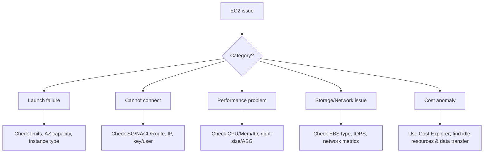

# EC2 Troubleshooting

## Summary

- Most EC2 issues fall into a handful of categories: **launch failures, connectivity, performance, storage/network, cost**, and **status check failures**.
- Effective troubleshooting starts with a **standard checklist** (state, network/Security Group/route, logs, CloudWatch metrics) before making configuration changes.
- Strong monitoring and logging (CloudWatch, VPC Flow Logs, Systems Manager) dramatically reduce mean time to resolution.

## Troubleshooting flow

## Best Practices

- Always **verify the basics first**: instance state, correct Security Group rules, route tables, NACLs, DNS/IP, and correct SSH/RDP user and key.
- Use **CloudWatch metrics and logs** to pinpoint root causes (high CPU, I/O bottlenecks, network throttling, status check failures) instead of guessing.
- For **status check failures**:
  - System status → underlying host issue → stop/start to move to a new host, check AWS Health.
  - Instance status → OS/app/network issue inside the instance → inspect logs and configuration.
- For **performance issues**, prioritize right‑sizing, code/DB optimization, appropriate EBS volume and instance type selection, and enhanced networking/placement groups where applicable.
- For **cost anomalies**, look for always‑on instances, unattached EBS volumes, idle Elastic IPs, old snapshots, and unexpected data transfer patterns.
- Document root causes and fixes, then improve monitoring/alerting or configuration to prevent recurrence.

## Exam Notes

- Many questions describe **“cannot SSH/RDP”** or **“no internet”**; the expected approach is to walk through the basic connectivity checklist (state, SG, NACL, route, IP, key/user).
- Know the difference between **System status checks** (host issues, fixed by stop/start) and **Instance status checks** (OS/app/network issues, fixed by configuration changes).
- Cost‑related troubleshooting often involves identifying **idle resources** (running instances, unattached EBS, unused Elastic IPs, old snapshots) and **high data transfer** patterns.
- Key tools to remember: **CloudWatch (metrics/logs), VPC Flow Logs, Systems Manager, EC2 Instance Connect, AWS Health Dashboard, Cost Explorer, AWS Budgets**.

## AWS documentation

- [Troubleshoot Amazon EC2 instances](https://docs.aws.amazon.com/AWSEC2/latest/UserGuide/TroubleshootingInstances.html)
- [Status checks for your instances](https://docs.aws.amazon.com/AWSEC2/latest/UserGuide/monitoring-system-instance-status-check.html)

## Related docs in this Hub

- [EC2 Basics](./basics.md)
- [EC2 Best Practices](./best-practices.md)
- [CloudWatch Documentation](../../monitoring/cloudwatch/index.md)
