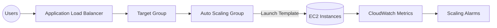

# Lab: Auto Scaling EC2 with ALB

> Build a production-style web tier that scales horizontally, reports health to an Application Load Balancer, and cleans itself up when idle.

## Lab Metadata

| Level | Role Fit | AWS Services | Estimated Time | Cost Warning |
| --- | --- | --- | --- | --- |
| Intermediate | Solutions Architect, Infra/DevOps Engineer | VPC, EC2, Launch Templates, Auto Scaling, ALB, CloudWatch | 60–90 minutes | <$1 when using t3.micro and deleting resources immediately. |

## Prerequisites

- AWS account with permissions for VPC, IAM roles/instance profiles, ALB, Auto Scaling, CloudWatch.
- Default VPC disabled? create a dedicated VPC with two public subnets in different AZs.
- SSH key pair (PEM or PPK) available locally, or use EC2 Instance Connect / Systems Manager Session Manager.
- Sample web content stored in S3 or simple `user_data` script ready.

## Architecture Overview



## Plan

1. Prepare networking + IAM role so instances can fetch updates/logs.
2. Create a Launch Template with user data that installs a lightweight web app.
3. Configure an ALB + Target Group with health checks on HTTP 80.
4. Create an Auto Scaling Group tied to two subnets and scaling policies.
5. Validate, observe scaling, then tear down every artifact.

## Build

### Step 1 – Network & IAM

1. Create (or reuse) a VPC with two public subnets; ensure route tables point to an Internet Gateway.
2. Define a Security Group allowing HTTP (80) from the world and SSH (22) from your IP.
3. Create an IAM role with the `AmazonSSMManagedInstanceCore` policy so the instance can use Session Manager.

### Step 2 – Launch Template

1. Open **EC2 → Launch Templates → Create template**.
2. Choose Amazon Linux 2023, `t3.micro`, attach the IAM role, and select the Security Group.
3. Paste user data similar to:

```bash
#!/bin/bash
dnf update -y
dnf install -y httpd
echo "<h1>EC2 Auto Scaling Lab</h1>" > /var/www/html/index.html
systemctl enable --now httpd
```

4. Save template version 1.

### Step 3 – Target Group & ALB

1. **EC2 → Target Groups → Create target group** of type `Instances`, port 80, health check path `/`.
2. **EC2 → Load Balancers → Create** Application Load Balancer with two public subnets, listener HTTP 80 forwarding to the new Target Group.

### Step 4 – Auto Scaling Group

1. **Auto Scaling Groups → Create** and select the Launch Template.
2. Choose both subnets, attach the Target Group, desired capacity `2`, min `2`, max `4`.
3. Add scaling policy: scale out at `CPU >= 60%` for 5 minutes, scale in at `CPU <= 20%` for 10 minutes.

## Verify

1. Wait for instances to show `InService` in the Target Group.
2. Hit the ALB DNS name; you should see the lab HTML page.
3. Generate load (e.g., `ab`/`hey` tool) to push CPU >60% and confirm a third/fourth instance launches.
4. Stop the load and ensure the ASG scales back to two instances after cooldown.

## Optimize

- Enable access logs on the ALB to S3 for audit trails.
- Add an HTTPS listener with ACM-managed certificate for production parity.
- Replace user data with a code pipeline or image pipeline for reproducible deployments.
- Add an Amazon CloudWatch dashboard to visualize request count, latency, and instance metrics in one place.

## Tear Down

1. Delete the Auto Scaling Group (which also terminates instances).
2. Delete the Launch Template if it was created only for this lab.
3. Delete the ALB and Target Group.
4. Remove Security Groups, IAM roles, and key pairs if they were lab-specific.
5. Delete the VPC/subnets/Internet Gateway if no longer needed.

## Validation & Troubleshooting

### Expected Results

- ALB health checks stay `healthy` after launch.
- Scaling policies add/remove instances according to the CPU alarms.
- Cost Explorer (next day) shows only pennies of EC2/ALB usage.

### Common Issues

| Symptom | Likely root cause | Fix |
| --- | --- | --- |
| Target Group shows `unhealthy`. | Security Group missing port 80 or user data failed to start Apache. | Open port 80 inbound and review `/var/log/cloud-init-output.log`. |
| ASG cannot launch instances. | Subnet not associated with Internet Gateway or no public IP assigned. | Enable Auto-assign public IP or add NAT + private subnets. |
| Scaling policies never trigger. | CloudWatch alarm not bound to ASG or metric set to `Average` across entire group. | Attach alarm to policy and verify `per-instance` metrics exist. |

## Reflection & Exam Mapping

- Map the lab to **SAA-C03 Domain 2 (Design Resilient Architectures)** by explaining how ALB + ASG remove single points of failure.
- Translate observations into **CLF-C02 Domain 2** style questions: Which option protects credentials? Why prefer IAM roles over static keys?
- Capture notes on cost levers (instance types, scaling limits) to answer **SOA-C02** operational efficiency questions.
