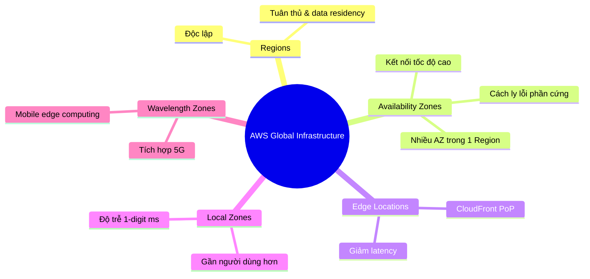

# Hạ tầng toàn cầu AWS

## Tóm tắt

- Hạ tầng AWS gồm **Regions, Availability Zones (AZs), Edge Locations, Local Zones, Wavelength Zones** được thiết kế để đạt **độ sẵn sàng cao, độ trễ thấp và khả năng chống lỗi tốt**.
- Khi thiết kế hệ thống trên AWS, việc chọn Region và cách phân bổ workload giữa các AZ/Edge ảnh hưởng trực tiếp tới **độ tin cậy, chi phí và tuân thủ**.
- Thiết kế tốt thường gồm **Multi‑AZ cho high availability**, và **Edge/CloudFront** để tối ưu trải nghiệm người dùng toàn cầu.

## Bức tranh hạ tầng AWS

## Best Practices

- **Chọn Region có ý thức**: cân bằng giữa latency tới user, yêu cầu pháp lý (data residency), danh sách dịch vụ hỗ trợ và giá.
- **Luôn thiết kế Multi‑AZ cho workload quan trọng**: EC2, RDS, ECS, ALB… nên trải trên tối thiểu 2 AZ trong cùng Region.
- Sử dụng **CloudFront + Edge Locations** cho web/app phân tán toàn cầu để giảm độ trễ và giảm tải lên origin.
- Với yêu cầu **ultra low latency** cho game, media, 5G, cân nhắc Local Zones hoặc Wavelength (nếu khu vực hỗ trợ).
- Luôn nghĩ về **kịch bản DR**: Multi‑AZ cho HA trong Region, Multi‑Region cho yêu cầu DR cao và tuân thủ đặc biệt.

## Exam Notes

- Phải phân biệt rõ:
  - **Region**: vùng địa lý độc lập.
  - **Availability Zone**: 1+ datacenter trong Region, cách ly lỗi.
  - **Edge Location**: điểm hiện diện cho CloudFront / Lambda@Edge.
- Các câu hỏi HA/DR thường **kỳ vọng Multi‑AZ** chứ không phải chỉ 1 AZ.
- Data residency & compliance (vd. GDPR) thường dẫn tới đáp án: **chọn Region phù hợp, không tự forward dữ liệu sang region khác nếu không được phép**.

## AWS documentation

- [AWS Global Infrastructure](https://aws.amazon.com/about-aws/global-infrastructure/)
- [Regions and Availability Zones](https://docs.aws.amazon.com/AWSEC2/latest/UserGuide/using-regions-availability-zones.html)
