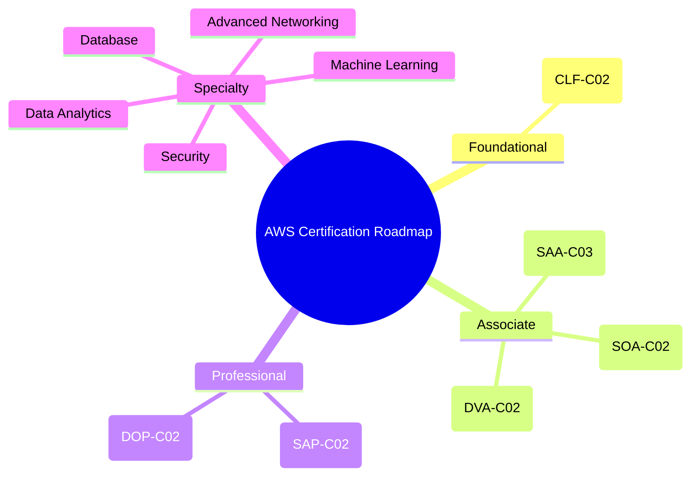

# Lộ trình chứng chỉ

## Tóm tắt

- Hệ thống chứng chỉ AWS được chia theo **cấp độ (Foundational, Associate, Professional)** và **Specialty** theo từng mảng sâu.
- Lý tưởng nhất, bạn nên đi từ **Cloud Practitioner → 1–2 chứng chỉ Associate → Professional hoặc Specialty** tuỳ định hướng.
- Mục tiêu của roadmap là giúp bạn **không bị “quá tải”** và chọn đúng thứ cần học tương ứng với công việc.

## Mindmap lộ trình chứng chỉ

## Best Practices

- **Gắn chứng chỉ với job role**:
  - Dev/backend → ưu tiên `Developer Associate`, `Solutions Architect Associate`.
  - Ops/SRE/Infra → `SysOps`, `DevOps Professional`.
  - Architect → `SAA` → `SAP`.
- **Không cần lấy tất cả chứng chỉ**: chọn 1–2 dòng chính rồi đi sâu, tránh dàn trải.
- Dùng `Cloud Practitioner` như **bước khởi động** nếu bạn mới hoàn toàn với cloud hoặc muốn hiểu high‑level cho business.
- Sau khi qua Associate, nên có **kinh nghiệm thực tế** 6–12 tháng trước khi lên Professional để tránh học quá lý thuyết.
- Với Specialty, chỉ nên thi khi bạn thực sự làm việc trong mảng đó (security, data, ML…), vì nội dung khá sâu và rộng.

## Exam Notes

- Các đề Specialty và Professional thường **rất nặng về scenario**, yêu cầu bạn hiểu nhiều dịch vụ kết hợp; base kiến thức Associate là bắt buộc.
- `Cloud Practitioner` tập trung vào **khái niệm, pricing, support, high‑level services** hơn là config chi tiết.
- Luôn xem **Exam Guide + Sample Questions** trên AWS Training trước khi bắt đầu lộ trình học cho bất kỳ chứng chỉ nào.

## AWS documentation & resources

- [AWS Certification Paths](https://aws.amazon.com/certification/)
- [Exam Guides & Sample Questions](https://aws.amazon.com/certification/certification-prep/)
