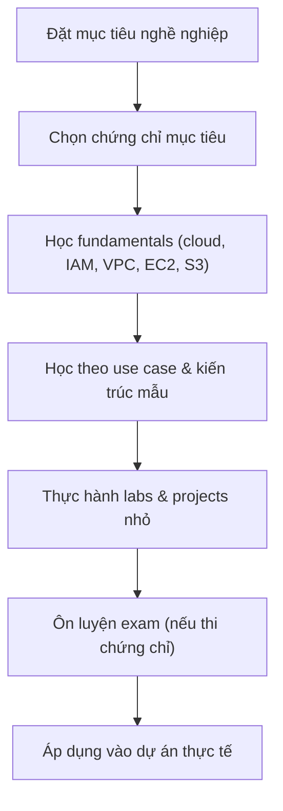

# Cách học AWS hiệu quả

## Tóm tắt

- Học AWS hiệu quả cần kết hợp **lý thuyết từ tài liệu chính thức** với **thực hành đều đặn** trên console/CLI/labs.
- Nên xuất phát từ **use case thực tế** (host web app, data analytics, automation…) thay vì học rời rạc từng dịch vụ.
- Việc chuẩn bị cho **chứng chỉ AWS** nên được gắn với mục tiêu nghề nghiệp (dev, ops, architect, data…) để chọn đúng roadmap.

## Flow học AWS đề xuất

## Best Practices

- **Tập trung vào fundamentals trước**: Cloud basics, IAM, VPC, EC2, S3, RDS là “core set” nên nắm vững.
- **Học theo vòng lặp ngắn**: đọc 20–30 phút → thử trên console/CLI 20–30 phút → ghi chú lại.
- **Ưu tiên nguồn chính thức**: AWS documentation, re:Post, Well‑Architected, whitepapers, skill builder; coi blog/video là bổ sung.
- **Xây lab nhỏ nhưng thực tế**: ví dụ website 3‑tier, static site trên S3 + CloudFront, batch job trên Lambda… lặp lại trên nhiều Region/AZ để hiểu hạ tầng.
- **Luyện giải bài tập theo scenario**: nhất là nếu thi chứng chỉ, nên quen với kiểu câu hỏi “use case + requirement + constraint”.
- **Đặt giới hạn thời gian**: tránh “doom‑scrolling docs”, mỗi phiên học nên có mục tiêu rõ (vd. hiểu xong VPC Peering + demo).

## Exam Notes

- Các bài thi AWS tập trung vào **trade‑off và kiến trúc**, không yêu cầu nhớ từng tham số CLI; chiến lược ôn tập nên:
  - Tập trung hiểu use case từng dịch vụ chính.
  - Luyện đọc đề và gạch keyword (high availability, cost‑optimized, decoupled, serverless…).
  - Làm lại các câu sai, phân tích vì sao đáp án kia sai.

## AWS documentation & resources

- [AWS Skill Builder](https://explore.skillbuilder.aws/)
- [AWS Training and Certification](https://www.aws.training/)
- [AWS Ramp-Up Guides](https://aws.amazon.com/training/ramp-up-guides/)
