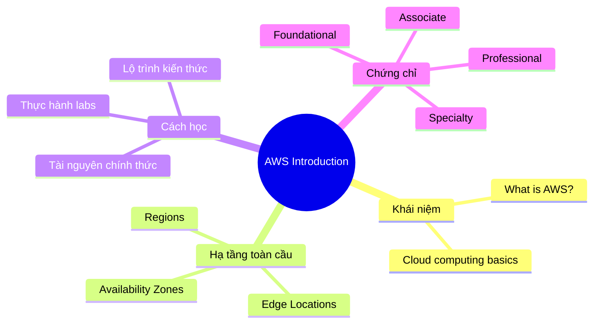

# Giới thiệu AWS

## Tóm tắt

- Đây là **điểm xuất phát** để hiểu AWS ở mức high-level: AWS là gì, hạ tầng toàn cầu hoạt động ra sao, nên học theo lộ trình nào.
- Cụm tài liệu này giúp bạn định vị **mục tiêu học**, chọn chứng chỉ phù hợp, và xây dựng thói quen học chủ động thay vì “học vẹt”.
- Sau khi nắm vững phần giới thiệu, bạn có thể chuyển sang các cụm `02-fundamentals` và `03-services` để đi sâu vào từng dịch vụ.

## Bức tranh tổng quan hành trình AWS

## Best Practices

- **Bắt đầu từ bức tranh tổng thể**: đọc `What is AWS` và `AWS Global Infrastructure` trước khi đi vào từng dịch vụ.
- **Xác định mục tiêu rõ ràng**: chọn chứng chỉ mục tiêu (vd. `Solutions Architect Associate`) rồi quay lại xem `Lộ trình chứng chỉ`.
- **Kết hợp đọc + thực hành**: sau mỗi phần khái niệm, nên làm một bài lab nhỏ (vd. tạo EC2, S3) để nhớ lâu hơn.
- **Dùng tài liệu chính thức**: ưu tiên AWS docs, re:Post, whitepaper; coi các nguồn khác là bổ trợ.
- **Ghi chú có cấu trúc**: tóm tắt theo dạng mindmap hoặc bullet, tập trung vào trade-off, best practices, và use case thay vì ghi chép lại toàn bộ.

## Gợi ý tiếp theo

- [AWS là gì?](./what-is-aws.md)
- [Hạ tầng toàn cầu AWS](./aws-global-infrastructure.md)
- [Cách học AWS hiệu quả](./how-to-study.md)
- [Lộ trình chứng chỉ](./certification-roadmap.md)
