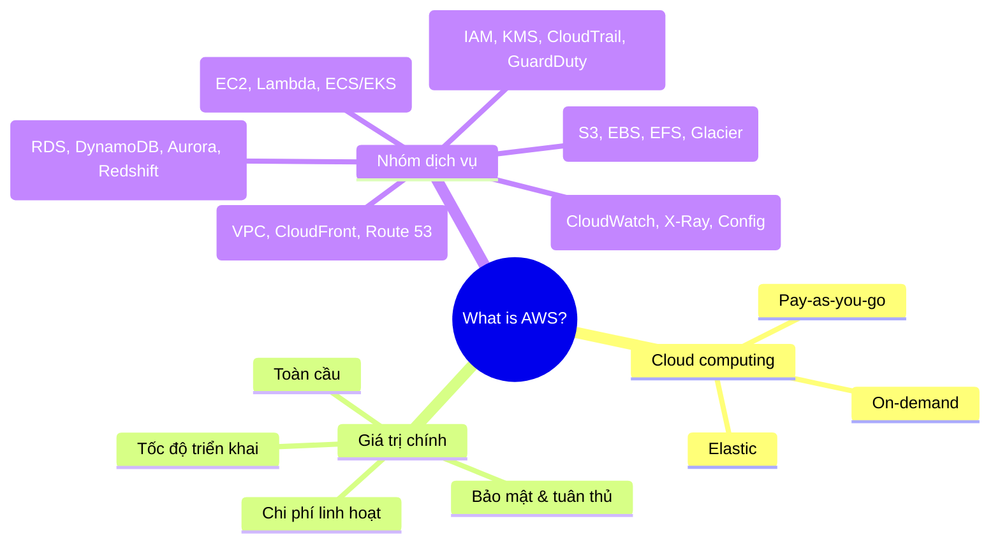

# AWS là gì?

## Tóm tắt

- **Amazon Web Services (AWS)** là nền tảng cloud toàn diện với hơn 200 dịch vụ hoàn chỉnh, cho phép bạn dùng **compute, storage, database, networking, AI/ML**… theo mô hình trả tiền theo mức sử dụng.
- Cloud computing giúp bạn **không cần tự mua/bảo trì datacenter**, mà thuê hạ tầng linh hoạt từ AWS với khả năng co giãn cực nhanh.
- AWS nổi bật nhờ **hạ tầng toàn cầu lớn**, độ tin cậy cao, bảo mật mạnh, và tốc độ ra dịch vụ mới rất nhanh.

## Bức tranh về AWS (mindmap)

## Best Practices (góc nhìn người mới)

- **Hiểu bản chất cloud trước dịch vụ**: nắm 3 ý chính – on‑demand, pay‑as‑you‑go, elasticity – rồi mới đi sâu vào từng service.
- **Nhóm dịch vụ theo use case**: ví dụ “host web app” → EC2/Lambda + RDS/DynamoDB + VPC + CloudFront + IAM, thay vì học rời rạc từng tên.
- **Luôn nghĩ về shared responsibility model**: AWS chịu trách nhiệm “of the cloud”, bạn chịu trách nhiệm “in the cloud” (cấu hình, dữ liệu, IAM, network).
- **Đọc docs ở mức high‑level**: với người mới, chỉ cần nắm service là gì, giải bài toán nào, có điểm khác biệt gì so với giải pháp truyền thống.
- **Ghi lại từ khoá quan trọng**: EC2, S3, RDS, VPC, IAM là 5 cái tên nên nắm thật chắc ở giai đoạn Intro.

## Exam Notes

- Trong các đề thi AWS (đặc biệt là `Cloud Practitioner` và `Solutions Architect – Associate`), bạn cần:
  - Nhận diện **nhóm dịch vụ chính** và use case điển hình (EC2 để chạy VM, S3 để lưu object, RDS cho DB quan hệ…).
  - Hiểu **lợi ích cloud**: agility, elasticity, pay‑as‑you‑go, global reach, chi phí vận hành giảm.
  - Nhớ **shared responsibility model** và một vài ví dụ ai chịu trách nhiệm phần nào.

## AWS documentation

- [What is AWS?](https://docs.aws.amazon.com/whitepapers/latest/aws-overview/what-is-aws.html)
- [AWS Cloud Value Proposition](https://docs.aws.amazon.com/whitepapers/latest/aws-overview/introduction.html)
