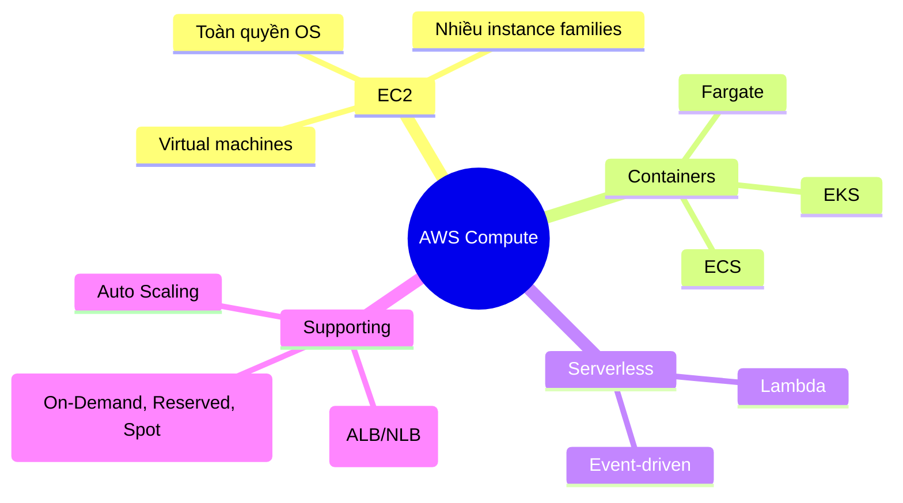

# Tổng quan Compute

## Tóm tắt

- AWS cung cấp nhiều mô hình compute: **máy ảo (EC2), containers (ECS/EKS/Fargate), serverless (Lambda)** để phù hợp với từng kiểu workload.
- Trade‑off chính là giữa **mức độ kiểm soát, chi phí vận hành và tốc độ triển khai**: EC2 cho toàn quyền, containers cân bằng, Lambda tối ưu agility và giảm vận hành.
- Pricing và cơ chế scale (On‑Demand, Reserved, Spot, Auto Scaling) là phần không thể tách rời khi thiết kế compute.

## Bức tranh Compute trên AWS

## Best Practices

- Dùng **EC2** khi cần toàn quyền OS, cấu hình đặc biệt, workload chạy lâu (bao gồm GPU/benchmark…).
- Dùng **containers (ECS/EKS + Fargate/EC2)** cho microservices, workload cần portability, cần scale linh hoạt nhưng vẫn kiểm soát tốt.
- Dùng **Lambda** cho workload event‑driven, traffic khó đoán, cần giảm tối đa chi phí vận hành.
- Kết hợp **Auto Scaling + load balancer (ALB/NLB)** để xử lý traffic biến động và tăng độ sẵn sàng, thay vì giữ một cụm cố định over‑provisioned.
- Kết hợp **pricing models**: On‑Demand cho usage khó đoán, Reserved/Savings Plans cho phần usage ổn định, Spot cho batch/fault‑tolerant.

## Exam Notes

- Phải map được scenario → lựa chọn compute:
  - Toàn quyền OS, lift‑and‑shift app cũ → **EC2**.
  - Microservices, Kubernetes → **ECS/EKS + Fargate/EC2**.
  - Event‑driven, chi phí nhạy cảm, traffic bất thường → **Lambda**.
- Nắm vững ý tưởng **Auto Scaling**, **khác nhau giữa ALB vs NLB**, và **On‑Demand vs Reserved vs Spot** ở mức conceptual (không cần nhớ số).

## AWS documentation

- [Compute services on AWS](https://docs.aws.amazon.com/whitepapers/latest/aws-overview/compute-services.html)
