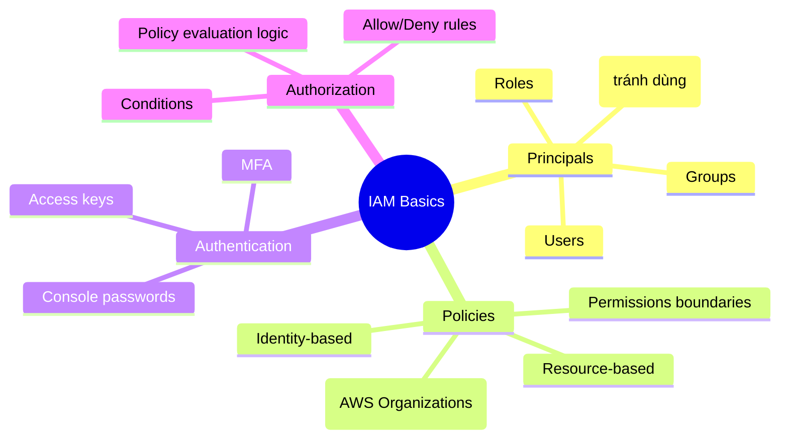

# IAM cơ bản

## Tóm tắt

- AWS Identity and Access Management (IAM) quyết định **ai được làm gì, trên tài nguyên nào, trong điều kiện nào** trong tài khoản AWS.
- Các khối cơ bản gồm **principal (user/role), policy và permissions boundary**, kết hợp với nhau để thực thi nguyên tắc least‑privilege.
- Nền tảng IAM tốt là bắt buộc cho bảo mật và quản trị multi‑account, và là phần trọng tâm trong các kỳ thi AWS.

## Mindmap khái niệm IAM

## Best Practices

- **Không dùng root user cho hoạt động hằng ngày**, chỉ dùng cho một số tác vụ account‑level; bật MFA và bảo vệ kỹ.
- Ưu tiên **IAM Role** thay vì access key dài hạn; gán role cho EC2, Lambda, ECS task… và dùng temporary credentials (STS).
- Thực thi **least privilege**: chỉ cấp action và resource cần thiết, dùng thêm condition (vd. `aws:RequestedRegion`, `aws:MultiFactorAuthPresent`) khi phù hợp.
- Dùng **group và role‑based access** cho người dùng; tránh attach policy trực tiếp vào từng user riêng lẻ.
- Trong môi trường multi‑account, dùng **AWS Organizations + SCP** để đặt guardrail chung cho toàn bộ accounts.

## Exam Notes

- Phân biệt rõ **user, group, role** và khi nào dùng loại nào.
- Biết các loại policy (identity‑based, resource‑based, permissions boundary, SCP) và cách IAM evaluate policy (explicit deny luôn thắng).
- Nhiều câu hỏi yêu cầu chọn combination “đẹp”: **IAM Role + MFA + least‑privilege policy** thay vì phương án “dễ mà nguy hiểm” (quyền `*`, root user, access key hard‑code).

## AWS documentation

- [What is IAM?](https://docs.aws.amazon.com/IAM/latest/UserGuide/introduction.html)
