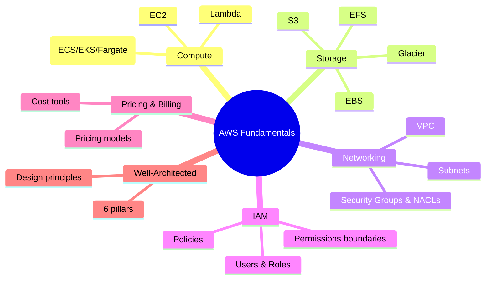

# Nền tảng cơ bản

## Tóm tắt

- Cụm này tổng hợp những khối kiến thức **nền tảng nhất của AWS**: compute, storage, networking, IAM, pricing/billing và Well‑Architected.
- Mục tiêu là giúp bạn có **bức tranh kiến trúc chung**, hiểu cách các mảnh ghép kết nối với nhau thay vì học rời rạc từng service.
- Khi nắm vững fundamentals, việc đi sâu vào cụm `03-services` (EC2, S3, RDS, VPC…) sẽ dễ và “có ngữ cảnh” hơn nhiều.

## Bản đồ fundamentals

## Best Practices

- Xem fundamentals như **ngôn ngữ chung**: dù bạn làm dev, ops hay data, các chủ đề này đều lặp lại trong mọi kiến trúc.
- Khi đọc, luôn tự hỏi: *“Khái niệm này ảnh hưởng tới pillar nào của Well‑Architected (Security, Reliability, Cost, Performance, Operational Excellence, Sustainability)?”*
- Mỗi chủ đề nên gắn với ít nhất một **lab nhỏ** (tạo VPC, cấu hình Security Group, launch EC2, upload object lên S3…).

## Các chủ đề trong cụm này

- [Tổng quan Compute](./compute-overview.md)
- [Tổng quan Storage](./storage-overview.md)
- [Tổng quan Networking](./networking-overview.md)
- [IAM cơ bản](./iam-basics.md)
- [Pricing & Billing](./pricing-billing.md)
- [Well-Architected Framework](./well-architected-overview.md)
