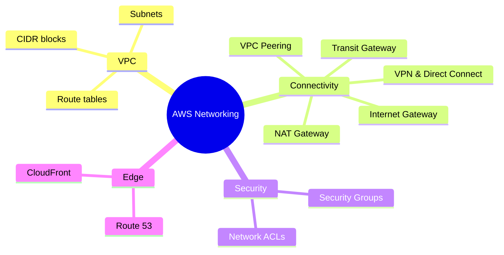

# Tổng quan Networking

## Tóm tắt

- Networking trên AWS xoay quanh **VPC, subnets, route tables, Internet/NAT Gateway, Security Group và Network ACL**.
- Các thành phần này quyết định cách tài nguyên giao tiếp **bên trong AWS, với on‑premises và với internet**, đồng thời là “xương sống” cho bảo mật và độ sẵn sàng.
- Hiểu vững VPC là điều kiện gần như bắt buộc trước khi thiết kế hệ thống production hoặc thi phần lớn chứng chỉ AWS.

## Bức tranh Networking trên AWS

## Best Practices

- Thiết kế **VPC và subnet** rõ ràng (CIDR planning, phân tách public/private) thay vì dùng default VPC cho môi trường production.
- Dùng **Security Group** làm firewall chính, cấu hình theo nguyên tắc least‑privilege và ưu tiên tham chiếu SG khác thay vì mở CIDR rộng.
- Dùng **Network ACL** như một lớp guardrail stateless ở tầng subnet cho môi trường nhạy cảm.
- Cho outbound‑only internet từ private subnet, dùng **NAT Gateway**; chỉ đưa load balancer/bastion vào public subnet.
- Đơn giản hoá kết nối giữa nhiều VPC bằng **VPC Peering** hoặc **Transit Gateway**, đặc biệt trong môi trường multi‑account.

## Exam Notes

- Phân biệt rõ **Security Group (stateful, gắn vào instance/ENI)** và **NACL (stateless, subnet‑level)** và biết chọn cái nào trong từng scenario.
- Nắm các pattern chuẩn: public subnet + IGW cho tài nguyên internet‑facing, private subnet + NAT cho app/DB tiers, VPN/Direct Connect cho hybrid.
- Nhiều câu hỏi mô tả triệu chứng (“không ra internet được”, “instances không nói chuyện được với nhau”, “latency cao”) nhưng gốc vấn đề nằm ở **SG/NACL/route table**.

## AWS documentation

- [Amazon VPC User Guide](https://docs.aws.amazon.com/vpc/latest/userguide/what-is-amazon-vpc.html)
