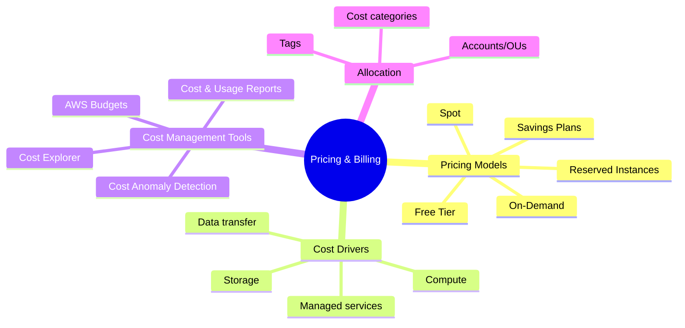

# Pricing & Billing

## Tóm tắt

- Pricing trên AWS chủ yếu theo mô hình **pay‑as‑you‑go**, với các lựa chọn như **On‑Demand, Reserved Instances/Savings Plans, Spot** để phù hợp với từng kiểu workload.
- Hiểu các driver chi phí (compute, storage, data transfer) và sử dụng cost tools là bắt buộc để tránh “bill bất ngờ” và thiết kế kiến trúc tối ưu chi phí.
- Chiến lược **tagging và phân bổ chi phí** quan trọng không kém phần kỹ thuật.

## Bức tranh Pricing & Billing

## Best Practices

- Thiết kế **tagging strategy** ngay từ đầu (Environment, Project, Owner, CostCenter) để có thể phân tích chi phí theo workload/team.
- Dùng **Cost Explorer & AWS Budgets** để theo dõi trend và nhận cảnh báo; bật **Cost Anomaly Detection** để phát hiện sớm bất thường.
- Kết hợp pricing models: On‑Demand cho workload khó đoán, Reserved/Savings Plans cho baseline ổn định, Spot cho workload chịu được gián đoạn.
- Nắm **data transfer pricing** (đặc biệt cross‑Region và internet egress) và thiết kế để giảm traffic không cần thiết.
- Mỗi tháng nên review bill và **dọn tài nguyên thừa** (EC2 quên tắt, EBS unattached, Elastic IP không dùng, snapshot cũ…).

## Exam Notes

- Phải chọn được **pricing model phù hợp** theo scenario (workload ổn định vs biến động, chấp nhận được gián đoạn hay không, thời gian cam kết).
- Nắm được mục đích của từng **cost tool**: Cost Explorer (phân tích), Budgets (alert), Cost & Usage Reports (dữ liệu chi tiết), Trusted Advisor & RI/SP recommendations (tối ưu).
- `Free Tier` có giới hạn về thời gian và usage – đôi khi được nhắc trong scenario cho POC hoặc demo nhỏ.

## AWS documentation

- [How AWS Pricing Works](https://docs.aws.amazon.com/whitepapers/latest/how-aws-pricing-works/how-aws-pricing-works.html)
- [AWS Cost Management](https://docs.aws.amazon.com/cost-management/index.html)
