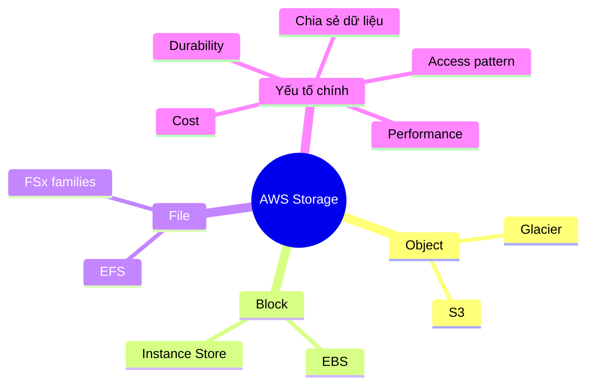

# Tổng quan Storage

## Tóm tắt

- Dịch vụ lưu trữ trên AWS bao phủ các nhu cầu **object (S3), block (EBS), file (EFS/FSx) và archive (Glacier)**, mỗi loại tối ưu cho một kiểu truy cập khác nhau.
- Việc chọn đúng loại storage phụ thuộc vào **pattern truy cập, hiệu năng, độ bền, chi phí và nhu cầu chia sẻ** (một instance hay nhiều, POSIX vs object, dữ liệu nóng vs lạnh).
- Nhiều kiến trúc thực tế kết hợp nhiều loại storage – ví dụ EC2 + EBS cho OS/data, S3 cho backup/log, EFS/FSx cho shared content.

## Bức tranh Storage trên AWS

## Best Practices

- Dùng **S3** như lựa chọn mặc định cho object storage, data lake, backup, static assets; tận dụng storage classes (Standard, IA, Glacier…) để tối ưu chi phí.
- Dùng **EBS** làm block storage chính cho EC2; chọn volume type (gp3, io1/io2, st1, sc1) theo IOPS/throughput và chi phí; tránh lưu dữ liệu quan trọng chỉ trên instance store.
- Dùng **EFS/FSx** khi nhiều EC2 cần chia sẻ file system kiểu POSIX (web content, home dir, shared app data…).
- Thiết kế **lifecycle, versioning, replication** (S3 Lifecycle, EBS snapshot, cross‑Region replication) theo yêu cầu RPO/RTO và compliance.
- Thường xuyên rà soát và dọn **volumes, snapshots, buckets không dùng**, right‑size dung lượng và storage class để kiểm soát chi phí.

## Exam Notes

- Phân biệt rõ khi nào dùng:
  - **S3** vs **EFS/FSx** (object vs file, cách truy cập, nhu cầu chia sẻ).
  - **EBS** vs **instance store** (bền vững vs ephemeral).
  - Các **S3 storage class** (Standard, IA, One Zone, Glacier) theo trade‑off chi phí vs độ bền.
- Nắm được ý chính về **các loại volume EBS**, độ bền S3, cơ chế snapshot (incremental, lưu trong S3, có thể copy cross‑Region).

## AWS documentation

- [AWS storage services](https://docs.aws.amazon.com/whitepapers/latest/aws-overview/storage-services.html)
