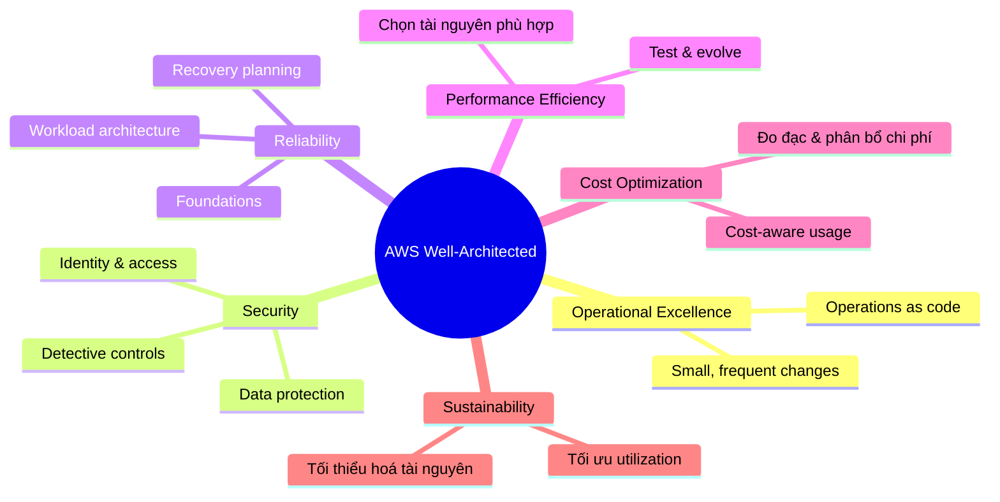

# Well-Architected Framework

## Tóm tắt

- **AWS Well-Architected Framework** đưa ra bộ trụ cột và nguyên tắc giúp bạn xây workload trên cloud sao cho **an toàn, tin cậy, hiệu năng tốt, tối ưu chi phí và bền vững**.
- Đây là “ngôn ngữ chung” để review kiến trúc, phát hiện rủi ro và ưu tiên hạng mục cải tiến.
- Phần lớn câu hỏi trong các kỳ thi AWS thực chất là câu hỏi Well‑Architected được “bọc” trong scenario.

## Mindmap các trụ cột

## Best Practices

- Dùng framework như một **công cụ review định kỳ**, không chỉ là tài liệu – thực hiện Well‑Architected review cho các workload quan trọng.
- Luôn link quyết định thiết kế với trụ cột tương ứng (vd. Multi‑AZ + Auto Scaling → Reliability; managed services + automation → Operational Excellence).
- Ghi lại rủi ro và hạng mục cải tiến từ mỗi buổi review và đưa vào backlog với owner, deadline rõ ràng.
- Với workload mới, hãy dùng Well‑Architected như một **checklist thiết kế** ngay từ đầu, không chỉ sau khi triển khai xong.

## Exam Notes

- Nắm được **tên và ý chính** mỗi trụ cột, map được quyết định kiến trúc vào pillar tương ứng.
- Nhiều câu: _monitoring, automation, game day_ → Operational Excellence; _MFA, encryption, least privilege_ → Security; _Multi‑AZ, backup, DR_ → Reliability; _right‑size, Spot, tắt tài nguyên nhàn rỗi_ → Cost Optimization; _serverless, sử dụng tài nguyên hiệu quả_ → Performance & Sustainability.
- Khi có nhiều phương án “có vẻ đúng”, thường phương án **phù hợp Well‑Architected nhất** là đáp án đúng.

## AWS documentation

- [AWS Well-Architected Framework](https://docs.aws.amazon.com/wellarchitected/latest/framework/wellarchitected-framework.html)
