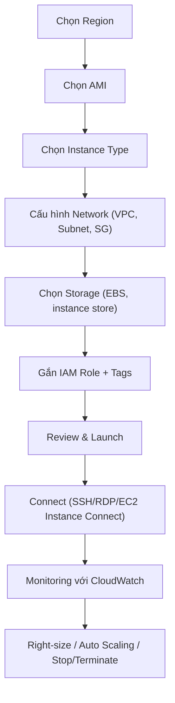

# Kiến thức cơ bản EC2

## Tóm tắt

- **Amazon EC2** cho phép bạn khởi chạy virtual servers (instances) trên AWS Cloud theo nhu cầu, lựa chọn AMI, instance type, storage, network và bảo mật phù hợp.
- Quy trình cơ bản gồm: chọn Region → chọn AMI → chọn instance type → cấu hình network/security/storage → gắn IAM role → xem lại và khởi chạy.
- Sau khi khởi chạy, bạn **kết nối** qua SSH (Linux) hoặc RDP (Windows), cấu hình ứng dụng, gắn thêm EBS volumes, và giám sát bằng CloudWatch.
- Việc **right‑size, gắn IAM role thay vì access key, giới hạn Security Groups và bật monitoring** là nền tảng cho vận hành EC2 an toàn, hiệu quả và tối ưu chi phí.

## Sơ đồ quy trình khởi chạy & quản lý EC2

## Best Practices

- **Chuẩn hóa quy trình khởi chạy**: dùng Launch Template hoặc IaC (CloudFormation/Terraform) thay vì click tay để đảm bảo cấu hình nhất quán.
- **Dùng IAM Role thay vì access key** trên instances; tuyệt đối không hard‑code credentials trong code hoặc lưu trên file hệ thống.
- **Giới hạn Security Groups** theo nguyên tắc least privilege, chỉ mở SSH/RDP từ IP tin cậy, và tách SG theo layer (web/app/db).
- **Tách OS và data volumes**, bật EBS encryption mặc định và dùng snapshots tự động để dễ backup/restore và migration.
- **Áp dụng monitoring & logging ngay từ đầu**: bật detailed monitoring, gửi logs lên CloudWatch Logs, đặt alarms cho CPU, status checks, disk, network.
- **Thực hành quản lý vòng đời**: dừng instances không dùng, terminate hẳn môi trường test/lab khi xong, và gắn tags (Environment/Owner/Project) để tracking chi phí.

## Exam Notes

- Nắm rõ **các bước trong Launch Instance wizard**: chọn AMI, instance type, network, storage, tags, security groups, key pair – thường xuất hiện trong câu hỏi scenario cơ bản.
- Phân biệt **các cách truy cập**: SSH (Linux), RDP (Windows), EC2 Instance Connect, Session Manager; khi nào nên dùng Instance Connect/SSM thay vì mở SSH rộng.
- Biết hiệu ứng của **Stop vs Terminate**: Stop giữ EBS volumes (bị tính phí storage), Instance store mất dữ liệu; Terminate xóa instance hoàn toàn.
- Nhớ rằng **IAM Role** là cách được khuyến nghị để EC2 gọi AWS APIs; khóa truy cập dài hạn trên instance luôn là anti‑pattern trong đề thi.

## Tài liệu AWS tham khảo

- [Get started with Amazon EC2](https://docs.aws.amazon.com/AWSEC2/latest/UserGuide/EC2_GetStarted.html)
- [Amazon EC2 User Guide – Launch your first instance](https://docs.aws.amazon.com/AWSEC2/latest/UserGuide/EC2_GetStarted.html)

## Tài liệu liên quan trong Hub

- [EC2 Instance Types](./instance-types.md)
- [EC2 Networking](./networking.md)
- [EC2 Storage](./storage.md)
- [EC2 Best Practices](./best-practices.md)
