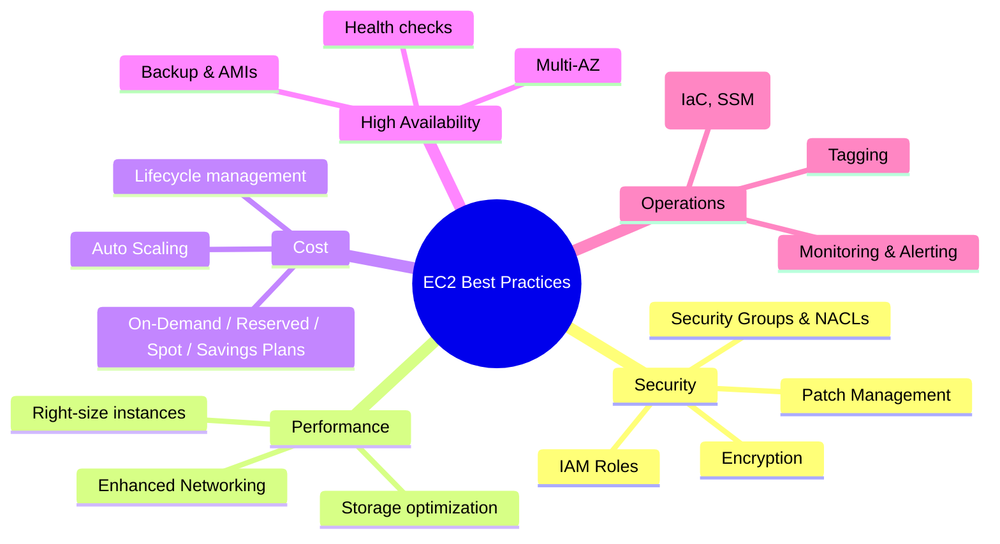

# Best Practices EC2

## Tóm tắt

- Best practices EC2 tập trung vào **bảo mật**, **hiệu suất**, **chi phí**, **high availability** và **vận hành/monitoring**, giúp môi trường EC2 an toàn và dễ quản lý.
- Cốt lõi là: dùng **IAM Role** thay vì access key, thiết kế **VPC + Security Group** đúng, **right‑size instances**, dùng **Auto Scaling + Multi‑AZ**, và tự động hóa backup/patching.
- Một chiến lược tốt luôn đi kèm **tagging, logging/monitoring đầy đủ**, và quy trình DR đã được kiểm thử.

## Sơ đồ mindmap best practices EC2

## Best Practices (tổng hợp)

- **Security**

  - Dùng **IAM Role** cho EC2 để lấy temporary credentials, không dùng access key static trên instance.
  - Thiết kế **Security Groups** theo nguyên tắc least privilege, tách theo chức năng (web/app/db), review định kỳ và bật VPC Flow Logs cho phân tích.
  - Bật **EBS encryption** (KMS), mã hóa snapshots và dùng TLS cho mọi traffic nhạy cảm.
  - Tự động hoá **patching** với Systems Manager (Patch Manager), có maintenance window và test trước trên non‑prod.

- **Performance**

  - **Right‑size** và ưu tiên current generation (M6/M7, C6/C7, R6/R7…) cho hiệu năng tốt hơn.
  - Bật **enhanced networking** (ENA/EFA) cho workloads network‑intensive; chọn placement group phù hợp nếu cần low‑latency.
  - Chọn **EBS volume type** đúng (gp3, io1/io2, st1, sc1) và dùng instance store cho cache/scratch, không lưu critical data.

- **Cost Optimization**

  - Kết hợp **On‑Demand + Reserved Instances/Savings Plans + Spot** theo profile workload (predictable vs batch vs thử nghiệm).
  - Dùng **Auto Scaling** để scale up/down theo tải, tránh over‑provisioning cố định.
  - Quản lý vòng đời: dừng/terminate instances không dùng, xoá EBS volumes unattached và snapshots cũ; dùng tags (Environment/Owner/Project/CostCenter).

- **High Availability & DR**

  - Triển khai **Multi‑AZ** (ASG + load balancer) cho web/app tier; dùng RDS Multi‑AZ hoặc cơ chế tương đương cho database.
  - Thiết lập **health checks** (system + instance + application) và tự động thay thế instances unhealthy qua Auto Scaling/ELB.
  - Tự động hóa **EBS snapshots, AMI “golden image”**, test restore định kỳ và lưu snapshot quan trọng cross‑Region nếu cần.

- **Operations & Monitoring**
  - Thiết lập **CloudWatch metrics, logs, dashboards, alarms** cho CPU, status checks, disk, network, app‑level metrics.
  - Dùng **Infrastructure as Code** (CloudFormation/Terraform) cho tất cả cấu hình, và Systems Manager cho cấu hình/automation.
  - Chuẩn hoá **tagging** và tài liệu (runbook, troubleshooting guide, recovery procedures).

## Exam Notes

- Câu hỏi best practices EC2 thường yêu cầu bạn **chọn giải pháp an toàn và được AWS khuyến nghị**, ví dụ: IAM Role + Security Group + Multi‑AZ + Auto Scaling + EBS encrypted.
- Nhớ: **Security Groups là stateful**, Network ACLs là stateless; use case và thứ tự áp dụng là điểm hay bị hỏi.
- **Cost optimization** trong đề thi thường gắn với: dùng Reserved/Savings Plans cho workloads ổn định, Spot cho batch/fault‑tolerant, và right‑sizing dựa trên CloudWatch metrics.
- **High Availability**: Multi‑AZ, health checks, ASG, load balancer; single instance trong một AZ hiếm khi là câu trả lời đúng cho production.

## Tài liệu AWS tham khảo

- [Security in Amazon EC2](https://docs.aws.amazon.com/AWSEC2/latest/UserGuide/ec2-security.html)
- [Amazon EC2 best practices](https://docs.aws.amazon.com/AWSEC2/latest/UserGuide/ec2-best-practices.html)

## Tài liệu liên quan trong Hub

- [EC2 Basics](./basics.md)
- [EC2 Cost Optimization](./cost-optimization.md)
- [EC2 Troubleshooting](./troubleshooting.md)
