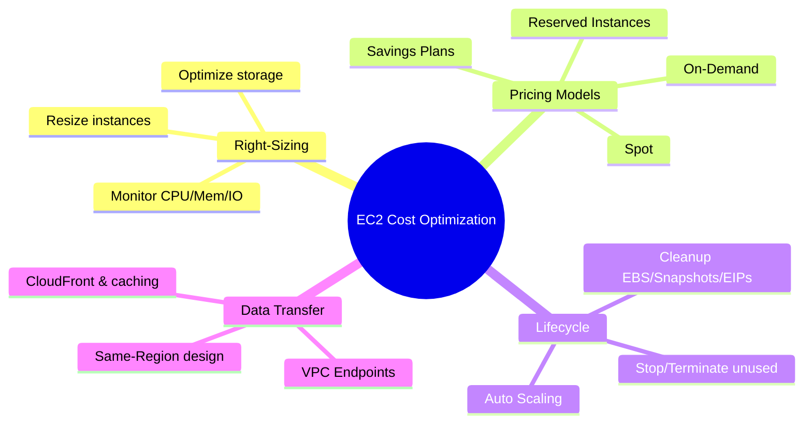

# Tối ưu hóa Chi phí EC2

## Tóm tắt

- Chi phí EC2 bao gồm **compute (instance)**, **storage (EBS, snapshots)**, **data transfer** và các dịch vụ phụ trợ (NAT, load balancer, v.v.); compute thường là phần lớn nhất.
- AWS cung cấp nhiều **mô hình giá** (On‑Demand, Reserved Instances, Spot, Savings Plans) để phù hợp với workload predictable, bursty, batch, thử nghiệm.
- Tối ưu chi phí hiệu quả dựa trên 3 trụ cột: **right‑sizing**, **lựa chọn mô hình giá phù hợp**, và **quản lý vòng đời/lưu lượng (Auto Scaling, dừng/terminate, tối ưu data transfer)**.

## Sơ đồ chiến lược tối ưu chi phí EC2

## Best Practices

- **Right‑size trước, mua cam kết sau**: thu thập metrics (CPU, memory, network, I/O) 2–4 tuần, giảm kích thước instances over‑provisioned và điều chỉnh volume EBS trước khi mua Reserved/Savings Plans.
- **Phân tầng mô hình giá**:
  - Baseline predictable → **Reserved Instances / Savings Plans**.
  - Bursty/batch/fault‑tolerant → **Spot Instances**.
  - Thử nghiệm/POC/ngắn hạn → **On‑Demand**.
- **Dùng Auto Scaling** thay cho việc chạy số lượng lớn instance cố định; scale‑in trong giờ thấp điểm để giảm chi phí.
- **Tối ưu storage**: dùng gp3 cho đa số workloads, chỉ dùng io1/io2 khi thực sự cần; xoá EBS volumes unattached, snapshots cũ và dùng lifecycle policies để dọn tự động.
- **Giảm data transfer**: thiết kế kiến trúc trong cùng Region/AZ khi có thể, dùng **VPC endpoints** cho S3/DynamoDB, dùng **CloudFront** và caching để giảm egress ra internet.
- **Chuẩn hoá tagging chi phí** (Environment, Project, Owner, CostCenter) và bật **AWS Budgets/Cost Explorer** để theo dõi và phát hiện bất thường (Cost Anomaly Detection).

## Exam Notes

- Cần nắm rõ **ưu/nhược điểm** của từng pricing model:
  - On‑Demand: linh hoạt, không cam kết, chi phí cao nhất/giờ.
  - Reserved Instances & Savings Plans: tiết kiệm lên đến ~72% cho workloads ổn định.
  - Spot: tiết kiệm lên đến ~90% nhưng có thể bị gián đoạn (2‑minute warning).
- Trong câu hỏi tối ưu chi phí, thường: **workload lâu dài, ổn định → Reserved/Savings Plans**, **batch/CI/CD → Spot**, **môi trường dev/test không 24/7 → stop/terminate hoặc Spot**.
- Nhớ rằng **stopped instances không tính phí compute nhưng vẫn tính phí EBS**, và **Elastic IPs idle** vẫn bị tính phí.
- AWS thường gợi ý **AWS Cost Explorer, AWS Budgets, Cost Anomaly Detection** là công cụ chính để quản lý và tối ưu hoá chi phí.

## Tài liệu AWS tham khảo

- [Amazon EC2 pricing](https://aws.amazon.com/ec2/pricing/)
- [AWS Cost Management tools](https://docs.aws.amazon.com/cost-management/index.html)

## Tài liệu liên quan trong Hub

- [EC2 Best Practices](./best-practices.md)
- [EC2 Instance Types](./instance-types.md)
- [AWS Pricing & Billing](../../../02-fundamentals/pricing-billing.md)
