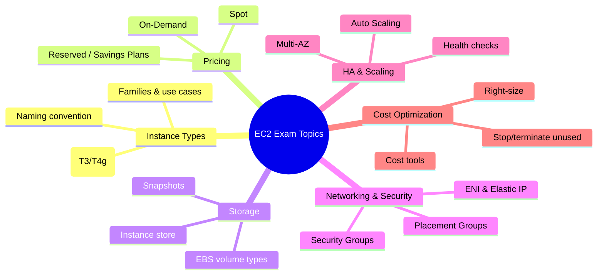

# Ghi chú Thi EC2

## Tóm tắt

- EC2 xuất hiện trong hầu hết các kỳ thi AWS (SAA, DVA, SOA, SAP); các chủ đề trọng tâm gồm **instance types & pricing models, storage, networking/security, high availability, cost optimization**.
- Câu hỏi thường là **tình huống thực tế** (scenario‑based), yêu cầu chọn giải pháp tốt nhất theo **Well‑Architected**: secure, reliable, performant, cost‑efficient.
- Ghi nhớ **các pattern mặc định** của AWS (IAM Role, Security Group, Multi‑AZ, Auto Scaling, EBS encrypted, Spot cho batch…) giúp loại bỏ nhanh các đáp án sai.

## Sơ đồ mindmap EC2 cho exam

## Exam Notes theo chủ đề

- **Instance Types & Naming**

  - Families: **M/T (General Purpose)**, **C (Compute Optimized)**, **R/X/High Memory (Memory Optimized)**, **I/D/H (Storage Optimized)**, **P/G/Inf/Trn (Accelerated)**.
  - Pattern: `[family][generation].[size]` – ví dụ `m6i.large`, `c7g.xlarge`.
  - **T2/T3/T4g** là burstable, dùng CPU credits; current generation (M6/M7, C6/C7, R6/R7) thường là đáp án tốt hơn M4/C4/R4.

- **Pricing Models**

  - **On‑Demand**: linh hoạt, không cam kết, chi phí cao nhất; dùng cho workloads ngắn hạn, không dự đoán được.
  - **Reserved Instances / Savings Plans**: tiết kiệm tới ~72% cho workloads ổn định, lâu dài (1–3 năm); thường là câu trả lời cho “predictable steady‑state”.
  - **Spot Instances**: giảm giá tới ~90%, có thể bị gián đoạn (2‑minute warning), dùng cho batch/CI/CD/ML training/fault‑tolerant.

- **Storage**

  - **EBS**: persistent, network‑attached; volume types:
    - `gp3` (default, general purpose), `io1/io2` (provisioned IOPS cho DB), `st1` (throughput HDD), `sc1` (cold HDD).
  - **Instance store**: local, ephemeral – mất dữ liệu khi stop/terminate; dùng cho cache/scratch, không cho dữ liệu quan trọng.
  - **Snapshots**: incremental, lưu trong S3 (ẩn), có thể copy cross‑Region và share; encrypted nếu volume gốc encrypted.

- **Networking & Security**

  - **Security Groups**: stateful, instance‑level; mặc định deny all inbound, allow all outbound; cho phép rules theo IP/CIDR hoặc SG khác.
  - **ENI**: Elastic Network Interface – virtual NIC với private IPs, Elastic IP, Security Group; mỗi instance có 1 primary ENI và có thể có nhiều ENI phụ.
  - **Placement Groups**:
    - Cluster: low latency, high throughput trong 1 AZ (HPC, tightly coupled).
    - Spread: high availability, max isolation (≤7 instances/AZ).
    - Partition: distributed systems lớn (Hadoop, Cassandra).

- **High Availability & Scaling**

  - **Multi‑AZ**: triển khai EC2 trong nhiều AZ + Auto Scaling Group + load balancer để tăng availability.
  - **Auto Scaling**: gồm Launch Template/Configuration, Auto Scaling Group, scaling policies (Target Tracking, Step, Simple), health checks.
  - **Status checks**:
    - System status: vấn đề host; fix bằng stop/start.
    - Instance status: vấn đề bên trong instance; cần troubleshooting cấu hình/application.

- **Cost Optimization**
  - Chiến lược điển hình: **right‑size → Reserved/Savings Plans cho steady‑state → Spot cho batch/fault‑tolerant → Auto Scaling → dừng/terminate resources không dùng**.
  - Theo dõi chi phí với **Cost Explorer, AWS Budgets, Cost Allocation Tags**, dùng anomaly detection để phát hiện spikes bất thường.

## Mẹo làm bài thi

- **Đọc kỹ scenario**: gạch chân các từ khoá như _steep increase in traffic, stringent compliance, unpredictable workload, require high availability, lowest cost option, fault‑tolerant_.
- **Ưu tiên giải pháp “managed” và “AWS recommended”**: IAM Role hơn access key, SG hơn open NACL, Multi‑AZ/ASG hơn single instance, EBS encrypted hơn unencrypted.
- **Loại trừ đáp án sai** dựa trên: vi phạm security best practices (public SSH từ mọi nơi, hard‑code credentials), không HA (single AZ, single instance), hoặc over‑engineering/costly rõ ràng.
- Luôn cân bằng **chi phí – hiệu suất – availability**: câu trả lời đúng thường là điểm giao thoa, không chỉ tối đa một yếu tố.

## Tài liệu AWS tham khảo

- [Amazon EC2 User Guide](https://docs.aws.amazon.com/AWSEC2/latest/UserGuide/concepts.html)
- [Amazon EC2 instance types](https://docs.aws.amazon.com/AWSEC2/latest/UserGuide/instance-types.html)
- [Pricing for Amazon EC2](https://aws.amazon.com/ec2/pricing/)

## Tài liệu liên quan trong Hub

- [EC2 Basics](./basics.md)
- [EC2 Instance Types](./instance-types.md)
- [EC2 Best Practices](./best-practices.md)
- [EC2 Cost Optimization](./cost-optimization.md)
- [AWS Certification Exam Guides](../../../07-exam/index.md)
