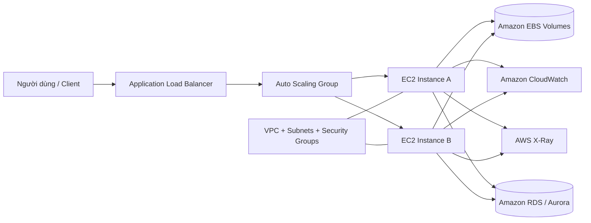

# Amazon EC2

## Tóm tắt

- **Amazon EC2** cung cấp virtual servers (EC2 instances) chạy trên AWS Cloud với khả năng scale up/down linh hoạt, giúp bạn giảm chi phí phần cứng và triển khai ứng dụng nhanh hơn.
- **Instance type** quyết định cấu hình CPU, memory, storage và networking; bạn cần chọn đúng loại theo workload (web, batch, HPC, ML, database…).
- **Môi trường xung quanh EC2** bao gồm Amazon EBS, VPC, Security Groups, IAM, Auto Scaling, Elastic Load Balancing và CloudWatch để đảm bảo bảo mật, hiệu suất và khả năng quan sát.
- **Mô hình giá** (On-Demand, Reserved, Spot, Savings Plans) ảnh hưởng lớn đến chi phí; việc right-size và kết hợp nhiều mô hình là chìa khóa tối ưu hóa.

## Sơ đồ kiến trúc (tổng quan EC2)

## Best Practices

- **Thiết kế theo “right-size”**: dùng instance type và size tối thiểu đáp ứng được workload, dựa trên metrics thực tế (CPU, RAM, network, I/O) từ CloudWatch.
- **Dùng Auto Scaling + ELB**: triển khai EC2 trong Auto Scaling Group và đặt sau Elastic Load Balancer để tự động scale theo tải và tăng high availability.
- **Cô lập mạng với VPC & Security Group**: đặt EC2 vào private subnets khi có thể, chỉ mở những ports cần thiết và dùng security groups làm nguồn (source) thay vì CIDR rộng.
- **Chuẩn hóa AMI & patching**: dùng AMI “golden image” cho môi trường, tự động hóa patch OS/agent với Systems Manager để giảm drift.
- **Bật monitoring & logging**: gửi system logs và application logs lên CloudWatch Logs, thiết lập alarms cho CPU, status check, disk và network để phát hiện sớm sự cố.
- **Sao lưu và bảo vệ dữ liệu**: sử dụng EBS encryption mặc định, snapshot định kỳ (Data Lifecycle Manager) và kiểm tra restore định kỳ cho kịch bản DR.
- **Quản lý chi phí chủ động**: kết hợp Savings Plans/Reserved Instances cho baseline, Spot cho batch/fault‑tolerant workloads, dừng/terminate instances không dùng và xóa EBS/snapshots dư thừa.

## Exam Notes

- Nắm vững **vòng đời EC2 instance** (pending → running → stopping/stopped → shutting-down → terminated) và tác động đến billing, EBS, instance store.
- Phân biệt rõ **mô hình giá**: On-Demand, Reserved Instances (Standard vs Convertible), Spot, Savings Plans và use case phù hợp cho từng loại.
- Biết sự khác nhau giữa **EBS volumes** (persistent, network-attached) và **instance store** (ephemeral, local), cùng các loại volume phổ biến (gp3, io1/io2, st1, sc1).
- Hiểu vai trò của **Security Groups (stateful)** và **Network ACLs (stateless)**, cũng như cách kết hợp với VPC, subnets, Internet/NAT Gateway.
- Nhớ các pattern điển hình cho **high availability**: Multi-AZ, Auto Scaling Group, sử dụng nhiều AZ ở layer web/app và dùng RDS Multi-AZ cho database.

## Tài liệu AWS tham khảo

- [What is Amazon EC2?](https://docs.aws.amazon.com/AWSEC2/latest/UserGuide/concepts.html)
- [Get started with Amazon EC2](https://docs.aws.amazon.com/AWSEC2/latest/UserGuide/EC2_GetStarted.html)

## Tài liệu liên quan trong Hub

- [EC2 Basics](./basics.md)
- [Instance Types](./instance-types.md)
- [Networking](./networking.md)
- [Storage](./storage.md)
- [Placement Groups](./placement-groups.md)
- [Best Practices](./best-practices.md)
- [Cost Optimization](./cost-optimization.md)
- [Troubleshooting](./troubleshooting.md)
- [Exam Notes](./exam-notes.md)
