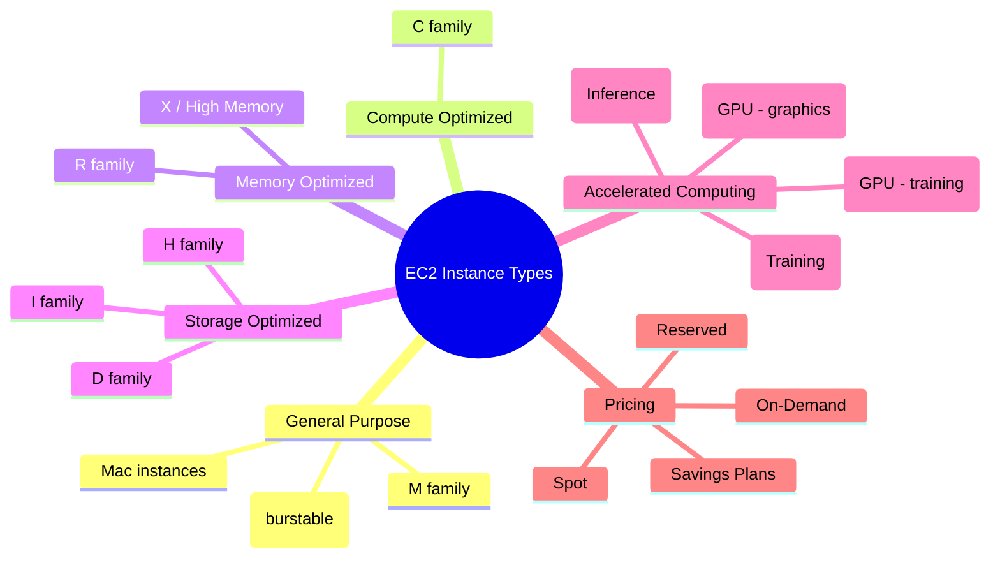

# Loại Instance EC2

## Tóm tắt

- **Instance type** quyết định cấu hình vCPU, memory, storage và networking của EC2 instance, vì vậy lựa chọn đúng loại là yếu tố sống còn cho hiệu suất và chi phí.
- Amazon EC2 cung cấp nhiều **instance families** (General Purpose, Compute Optimized, Memory Optimized, Storage Optimized, Accelerated Computing, v.v.) tối ưu cho các kiểu workload khác nhau.
- Mỗi family có nhiều **thế hệ (generation)** và **kích thước (size)**; bạn nên ưu tiên current generation (M6/M7, C6/C7, R6/R7…) để nhận được hiệu năng và giá tốt hơn.
- Chiến lược **right‑sizing + kết hợp mô hình giá (On-Demand, Reserved, Spot, Savings Plans)** giúp giảm chi phí đáng kể mà vẫn đảm bảo SLA.

## Sơ đồ mindmap instance types

## Best Practices

- **Bắt đầu từ workload, không phải từ instance**: mô tả workload (CPU‑bound, memory‑bound, I/O‑bound, GPU‑heavy…) rồi chọn family phù hợp thay vì chọn tên instance “quen tay”.
- **Ưu tiên current generation** (M6/M7, C6/C7, R6/R7…) để có hiệu năng tốt hơn và thường rẻ hơn/đơn vị hiệu suất so với previous generation (M5/C5/R5…).
- **Dùng burstable (T3/T4g)** cho workload nhẹ, biến động và không yêu cầu hiệu năng ổn định liên tục; theo dõi CPU credits để tránh throttling.
- **Tách workloads đặc biệt**: dùng R*/X*/High Memory cho database lớn, I*/D*/H*cho big data và P*/G*/Inf*/Trn*cho ML/HPC thay vì cố “nhét” tất cả lên M*.
- **Right‑size định kỳ**: ít nhất mỗi quý rà lại CPU/RAM/I/O metrics, downsize/break‑up instances over‑provisioned và cân nhắc Spot/Savings Plans cho phần usage ổn định.
- **Kết hợp nhiều loại**: baseline workloads dùng Reserved/Savings Plans trên families chính, workloads batch/CI/CD dùng Spot, còn workloads thử nghiệm thì giữ On‑Demand.

## Exam Notes

- Nhớ **pattern đặt tên**: `[family][generation].[size]` (ví dụ `m6i.large`, `c7g.xlarge`) và cách mapping tới use case:
  - General Purpose (M, T, Mac) – balanced workloads.
  - Compute Optimized (C) – CPU‑intensive.
  - Memory Optimized (R, X, High Memory) – in‑memory DB, caches.
  - Storage Optimized (I, D, H) – high throughput/I/O.
  - Accelerated (P, G, Inf, Trn) – GPU/ML/HPC.
- Biết **SAA/DVA** thường hỏi về: burstable instances (T2/T3/T4g, CPU credits), current vs previous generations, instance store vs EBS và EBS‑optimized/Enhanced networking.
- Nhớ các điểm nổi bật của **Nitro System** (hiệu năng cao, bảo mật tốt hơn, hỗ trợ enhanced networking) và khi nào cần **metal instances** (bare‑metal access, license yêu cầu).
- Trong câu hỏi tối ưu chi phí, hãy liên kết instance type với mô hình giá (ví dụ: `c6i` + Reserved hoặc Savings Plans cho workload compute‑intensive, predictable).

## Tài liệu AWS tham khảo

- [Amazon EC2 instance types](https://docs.aws.amazon.com/AWSEC2/latest/UserGuide/instance-types.html)
- [Amazon EC2 Instance Types Guide](https://docs.aws.amazon.com/ec2/latest/instancetypes/instance-types.html)

## Tài liệu liên quan trong Hub

- [EC2 Basics](./basics.md)
- [EC2 Cost Optimization](./cost-optimization.md)
- [EC2 Best Practices](./best-practices.md)
