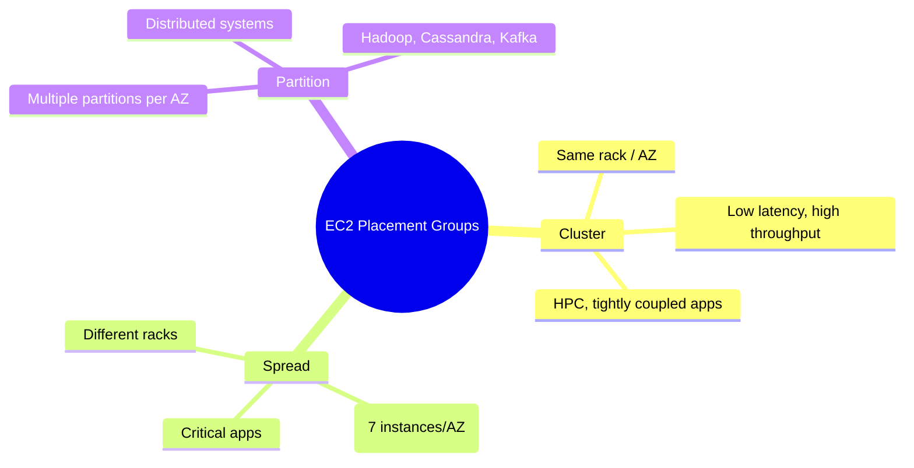

# Placement Groups EC2

## Tóm tắt

- **Placement group** là cách Amazon EC2 sắp xếp các instances trên phần cứng vật lý để tối ưu **network performance** hoặc **availability**, không làm thay đổi tính năng logic của instance.
- Có 3 loại: **Cluster** (low‑latency, high throughput trong một AZ), **Spread** (tách instances trên phần cứng khác nhau để tăng availability) và **Partition** (chia thành partitions cho distributed systems lớn).
- Placement group phù hợp giúp đạt được **throughput cao, latency thấp** hoặc **giảm correlated failures** mà không cần thay đổi ứng dụng quá nhiều.

## Sơ đồ so sánh placement groups

## Best Practices

- **Lên kế hoạch placement group trước khi khởi chạy**: type không thể đổi sau khi tạo; tốt nhất quyết định Cluster/Spread/Partition trong thiết kế kiến trúc.
- **Cluster Placement Group**: dùng cho HPC, ML training hoặc workloads cần network throughput cao và latency thấp; kết hợp với enhanced networking và current‑gen instances.
- **Spread Placement Group**: dùng cho **ít nhưng rất quan trọng** instances (tối đa 7/AZ) cần isolation mạnh để tránh correlated hardware failures.
- **Partition Placement Group**: dùng cho distributed systems lớn (Hadoop, Cassandra, Kafka) – ứng dụng phải **partition‑aware** để mapping node tới partition.
- Luôn **giám sát network metrics** (latency, throughput, packet loss) và status checks để phát hiện sớm vấn đề do capacity hoặc phần cứng.
- Nhớ rằng **placement group không tính phí thêm**, nhưng lựa chọn sai có thể làm tăng rủi ro downtime (cluster trong một AZ) hoặc hạn chế scale (limit instance/partition).

## Exam Notes

- Câu hỏi thi thường xoay quanh **chọn loại placement group đúng** cho scenario:
  - Low‑latency, high throughput giữa nhiều instances trong một AZ → **Cluster**.
  - Ít instances nhưng critical, cần isolation tối đa → **Spread**.
  - Hàng trăm nodes trong distributed system, cần tránh correlated failures theo nhóm → **Partition**.
- Nhớ các **giới hạn quan trọng**: Spread ≤ 7 instances/AZ; Partition ≤ 7 partitions/AZ; Cluster chỉ trong **một AZ**.
- Placement group **không thay thế** cho Multi‑AZ/Region DR; Cluster có thể tăng rủi ro khi AZ gặp sự cố.
- Một số instance types hoặc combinations có thể không khởi chạy được trong placement group vì capacity; đó là bẫy phổ biến trong câu hỏi.

## Tài liệu AWS tham khảo

- [Placement groups](https://docs.aws.amazon.com/AWSEC2/latest/UserGuide/placement-groups.html)

## Tài liệu liên quan trong Hub

- [EC2 Basics](./basics.md)
- [EC2 Networking](./networking.md)
- [EC2 Best Practices](./best-practices.md)
