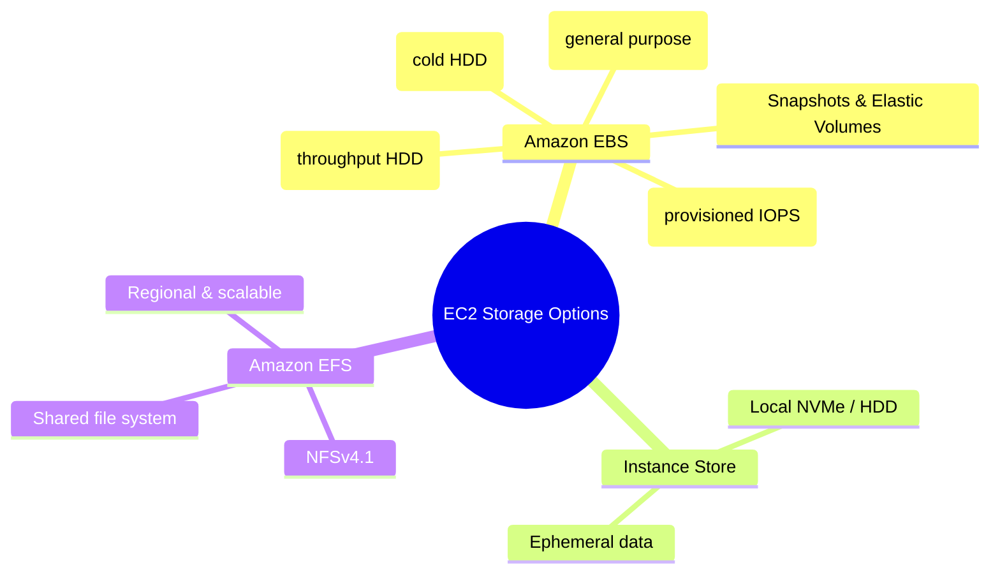

# Tùy chọn Storage EC2

## Tóm tắt

- EC2 hỗ trợ nhiều **tùy chọn storage**: Amazon EBS (block storage persistent), instance store (local ephemeral storage) và Amazon EFS (shared file system), mỗi loại phù hợp với một kiểu workload khác nhau.
- **Amazon EBS** là lựa chọn mặc định cho hầu hết workloads; bạn chọn giữa gp3, io1/io2, st1, sc1 dựa trên nhu cầu IOPS/throughput và chi phí.
- **Instance store** cho hiệu năng cực cao nhưng dữ liệu bị mất khi stop/terminate instance, nên chỉ dùng cho cache/scratch/temporary data.
- **Amazon EFS** cung cấp shared, scalable file system cho nhiều EC2 instances, phù hợp cho nội dung chia sẻ và ứng dụng cần POSIX file system.

## Sơ đồ tổng quan storage cho EC2

## Best Practices

- **Dùng gp3 cho mặc định**: áp dụng gp3 cho hầu hết volumes, điều chỉnh IOPS/throughput theo nhu cầu thay vì dùng gp2/legacy types.
- **Chỉ dùng io1/io2 khi thực sự cần IOPS cao và ổn định**, đi kèm việc giám sát metrics (VolumeReadOps/WriteOps, QueueLength) để tránh over‑provision.
- **Không lưu dữ liệu quan trọng trên instance store**; nếu phải dùng, luôn sao lưu dữ liệu quan trọng sang EBS hoặc S3 và hiểu rõ lifecycle khi stop/terminate.
- **Tách OS và data volumes** để nâng cấp, restore và thay đổi kích thước dễ hơn; dùng Elastic Volumes để tăng size/IOPS mà không downtime lớn.
- **Tự động hóa snapshot EBS** bằng Data Lifecycle Manager, đặt retention hợp lý và định kỳ dọn dẹp snapshots không cần để giảm chi phí.
- **Dùng EFS cho nhiều EC2 cần chia sẻ nội dung** (web content, home directories, container shared storage) và chọn đúng performance/throughput mode (General Purpose vs Max I/O, Bursting vs Provisioned).
- **Bật EBS encryption mặc định** (KMS) cho dữ liệu nhạy cảm, đảm bảo mã hóa cả volumes và snapshots mà không cần thay đổi ứng dụng.

## Exam Notes

- Nhớ mapping common volume types: **gp3** (mặc định, linh hoạt IOPS/throughput), **io1/io2** (Provisioned IOPS cho DB), **st1** (throughput HDD cho big data/log), **sc1** (cold HDD cho archive).
- EBS là **persistent, network‑attached block storage**, trong khi **instance store** là local, ephemeral; data instance store mất khi stop/terminate instance.
- **Snapshots** là incremental, lưu trong S3 (ẩn), có thể copy cross‑Region và dùng để tạo volume mới hoặc golden image.
- **EFS** thường xuất hiện trong câu hỏi cần shared POSIX storage cho nhiều instances, scaling tự động và multi‑AZ; phân biệt với S3 (object storage) và EBS (single‑instance).

## Tài liệu AWS tham khảo

- [What is Amazon EBS?](https://docs.aws.amazon.com/AWSEC2/latest/UserGuide/AmazonEBS.html)
- [Amazon EBS volume types](https://docs.aws.amazon.com/AWSEC2/latest/UserGuide/ebs-volume-types.html)
- [What is Amazon EFS?](https://docs.aws.amazon.com/efs/latest/ug/whatisefs.html)

## Tài liệu liên quan trong Hub

- [EC2 Basics](./basics.md)
- [EBS Documentation](../../storage/ebs/index.md)
- [EFS Documentation](../../storage/efs/index.md)
