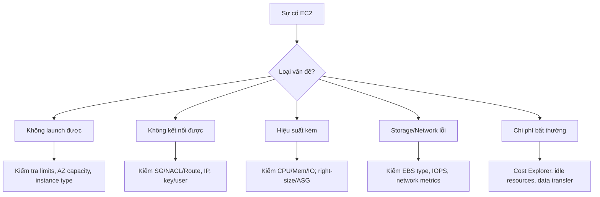

# Troubleshooting EC2

## Tóm tắt

- Các sự cố EC2 thường rơi vào 5 nhóm: **launch failures, kết nối, hiệu suất, storage/network, chi phí** và **status check failures**.
- Cách tiếp cận hiệu quả là dùng **checklist chuẩn**: kiểm tra state, network/Security Group/route, logs và CloudWatch metrics trước khi thay đổi cấu hình phức tạp.
- Monitoring & logging tốt (CloudWatch, VPC Flow Logs, Systems Manager) giúp phát hiện vấn đề sớm và đơn giản hóa troubleshooting.

## Sơ đồ quy trình troubleshooting EC2

## Best Practices

- **Luôn kiểm tra “những thứ cơ bản” trước**: instance có đang chạy không, SG/NACL/route đã cho phép traffic chưa, DNS/IP đúng chưa, key/user SSH/RDP đúng chưa.
- Sử dụng **CloudWatch metrics & logs** để xác định nguyên nhân gốc (CPU cao, disk I/O bottleneck, network throttling, status check failures) thay vì đoán.
- Đối với **status check failures**:
  - System status fail → stop/start để chuyển host, kiểm tra AWS Health Dashboard.
  - Instance status fail → xem system/application logs, network config, SG/NACL.
- Khi gặp vấn đề **hiệu suất**, ưu tiên: right‑size, tối ưu code/query, chọn volume hoặc instance type phù hợp, và xem xét placement group/enhanced networking nếu cần.
- Đối với **chi phí bất thường**, dùng Cost Explorer/AWS Budgets để tìm instance chạy 24/7, EBS unattached, Elastic IP idle, snapshots cũ, data transfer cross‑Region/Internet.
- **Ghi lại root cause và fix** (runbook), sau đó cải thiện monitoring/alerting để ngăn tái diễn.

## Exam Notes

- Đề thi thường đưa ra scenario “Không SSH/RDP được” hoặc “Không có internet” → bạn phải gỡ bằng checklist: state, SG, NACL, route, IP, key/user.
- Phân biệt **System status check** (vấn đề host, thường fix bằng stop/start) và **Instance status check** (vấn đề bên trong instance hoặc network).
- Trong câu hỏi về chi phí, **instances idle, EBS volumes unattached, Elastic IPs không dùng, snapshots cũ** là nguồn chi phí bị “quên” phổ biến.
- Các công cụ nên nhớ: **CloudWatch (metrics/logs), VPC Flow Logs, Systems Manager, EC2 Instance Connect, AWS Health Dashboard, Cost Explorer, AWS Budgets**.

## Tài liệu AWS tham khảo

- [Troubleshoot Amazon EC2 instances](https://docs.aws.amazon.com/AWSEC2/latest/UserGuide/TroubleshootingInstances.html)
- [Status checks for your instances](https://docs.aws.amazon.com/AWSEC2/latest/UserGuide/monitoring-system-instance-status-check.html)

## Tài liệu liên quan trong Hub

- [EC2 Basics](./basics.md)
- [EC2 Best Practices](./best-practices.md)
- [CloudWatch Documentation](../../monitoring/cloudwatch/index.md)
