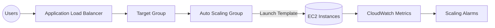

# Lab: EC2 + Auto Scaling + ALB

> Dựng nhanh lớp web có khả năng mở rộng ngang với Auto Scaling Group, kiểm tra sức khỏe qua Application Load Balancer và tự dọn sau khi hoàn tất.

## Thông tin lab

| Level | Đối tượng phù hợp | Dịch vụ AWS | Thời lượng ước tính | Cảnh báo chi phí |
| --- | --- | --- | --- | --- |
| Intermediate | Solutions Architect, Infra/DevOps Engineer | VPC, EC2, Launch Template, Auto Scaling, ALB, CloudWatch | 60–90 phút | <1 USD khi dùng t3.micro và xóa tài nguyên ngay. |

## Điều kiện tiên quyết

- Tài khoản AWS có quyền tạo VPC, IAM role/instance profile, ALB, Auto Scaling, CloudWatch.
- Nếu đã xóa Default VPC, hãy tạo VPC riêng với hai public subnet ở hai AZ khác nhau.
- Có sẵn SSH key pair hoặc dùng EC2 Instance Connect / Systems Manager Session Manager.
- Chuẩn bị nội dung web mẫu (S3 object) hoặc script `user_data` cài Apache.

## Kiến trúc mục tiêu



## Plan

1. Chuẩn bị network + IAM role để instances tải patch/log.
2. Tạo Launch Template với user data dựng web server nhẹ.
3. Cấu hình ALB + Target Group với health check HTTP 80.
4. Tạo Auto Scaling Group gắn hai subnet và policy scale.
5. Kiểm tra, tạo tải giả lập rồi dọn sạch mọi tài nguyên.

## Build

### Bước 1 – Network & IAM

1. Tạo (hoặc tái sử dụng) VPC có hai public subnet; route table phải trỏ tới Internet Gateway.
2. Security Group: mở HTTP (80) cho mọi nguồn, SSH (22) chỉ cho IP của bạn.
3. Tạo IAM role với policy `AmazonSSMManagedInstanceCore` để dùng Session Manager.

### Bước 2 – Launch Template

1. Vào **EC2 → Launch Templates → Create template**.
2. Chọn Amazon Linux 2023, `t3.micro`, gắn IAM role và Security Group vừa tạo.
3. Thêm user data:

```bash
#!/bin/bash
dnf update -y
dnf install -y httpd
echo "<h1>EC2 Auto Scaling Lab</h1>" > /var/www/html/index.html
systemctl enable --now httpd
```

4. Lưu template version 1.

### Bước 3 – Target Group & ALB

1. **EC2 → Target Groups → Create** loại `Instances`, port 80, health check path `/`.
2. **EC2 → Load Balancers → Create** Application Load Balancer, chọn hai public subnet, listener HTTP 80 forward tới Target Group.

### Bước 4 – Auto Scaling Group

1. **Auto Scaling Groups → Create** rồi chọn Launch Template.
2. Chọn hai subnet, gắn Target Group, Desired=2, Min=2, Max=4.
3. Tạo scaling policy: scale-out khi `CPU >= 60%` 5 phút, scale-in khi `CPU <= 20%` 10 phút.

## Verify

1. Chờ Target Group báo `healthy`.
2. Gõ DNS ALB, trang HTML lab phải hiển thị.
3. Dùng công cụ như `ab`/`hey` tạo tải để CPU >60% và quan sát instance thứ 3/4 được tạo.
4. Dừng tải và xác nhận ASG giảm về hai instance sau cooldown.

## Optimize

- Bật ALB access log lên S3 để audit.
- Thêm listener HTTPS + chứng chỉ ACM cho môi trường gần production.
- Thay user data bằng pipeline (CodeDeploy/EC2 Image Builder) để tái lập dễ dàng.
- Tạo dashboard CloudWatch để gom RequestCount, Latency, CPU, HealthyHostCount.

## Tear Down

1. Xóa Auto Scaling Group (đồng thời terminate instances).
2. Xóa Launch Template nếu chỉ phục vụ lab.
3. Xóa ALB và Target Group.
4. Gỡ Security Group, IAM role, key pair nếu chỉ dùng cho lab.
5. Xóa VPC/subnet/Internet Gateway nếu không còn nhu cầu.

## Validation & Troubleshooting

### Kết quả mong đợi

- ALB health check ở trạng thái `healthy` ổn định.
- Scaling policy kích hoạt khi CPU vượt ngưỡng và giảm khi tải hạ.
- Báo cáo chi phí hôm sau chỉ ghi nhận vài cent cho EC2/ALB.

### Lỗi thường gặp

| Triệu chứng | Nguyên nhân khả dĩ | Cách khắc phục |
| --- | --- | --- |
| Target Group `unhealthy`. | SG chưa mở port 80 hoặc user data không khởi động Apache. | Mở port 80 inbound, kiểm tra `/var/log/cloud-init-output.log`. |
| ASG không tạo được instance. | Subnet không ra Internet hoặc instance không có public IP. | Bật auto-assign public IP hoặc thêm NAT cho private subnet. |
| Không thấy scaling. | CloudWatch alarm không gắn với ASG hoặc metric đặt `Average` toàn nhóm. | Liên kết alarm đúng policy và kiểm tra metric per-instance. |

## Reflection & Exam Mapping

- Liên hệ **SAA-C03 Domain 2**: giải thích vì sao ALB + ASG loại bỏ single point of failure.
- Biến trải nghiệm thành câu hỏi kiểu **CLF-C02 Domain 2**: bảo vệ credential bằng IAM Role, Security Group hẹp.
- Ghi chú đòn bẩy chi phí (loại instance, giới hạn scaling) để trả lời câu hỏi tối ưu vận hành trong **SOA-C02**.
